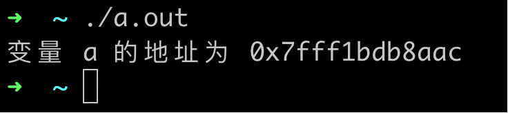

### 指针

#### 1. 指针与地址

程序运行过程中用到的各种变量，都需要在**运行内存 RAM**中占据一定的空间，运行内存的每个字节，都有自己的"编号"，这样才能被"找到"(读取或写入)，这个"编号"也称为地址。

比如一个 int 整型变量，可以通过下面的方式来显示出所在地址。

```clike
#include <stdio.h>

int main() {
    int a;
    int *p = &a;

    printf("变量 a 的地址为 %p\n", p);
    
    return 0;
}
```

运行结果如图。



上面的代码中涉及指针变量 p 的定义与赋值：

1. 定义一个指向 int 类型变量的指针 int *p
2. 给这种指针赋值的方式为 &a，& 称为取址符

> 可以回忆一下，前面我们使用 EEPROM 保存数据的时候，需要指明往哪个"格子"中保存数据，其作用和指针的用途一样，都是为了指明要使用哪个地址的"格子"。

指向不同类型数据，就需要用不同类型的指针，下面是示例代码。

```clike
double a;
double *p;

char c;
char *p;
```

##### 1.1 指针的运算符

既然知道指针保存的是某个内存格子的地址，然后我们就可以用这个地址进行读写。

```clike
// 读取指针指向的内存格子保存的内容。
int main() {
    int a = 1;   // 定义一个 int 变量
    int *p = &a; // 让 p 指向 a 变量

    int c;

    c = *p;      // 这里 *p 是取值操作，表示取出 p 所指向的内存格子中的数据。
    printf("此时 c 等于 %d\n", c);

    *p = 2;      // 这里表示向 p 指向的内存地址写入 2
    printf("此时 a 等于 %d\n", a);

    return 0;
}
```

> &取址 和 *取值，是指针两个重要操作。

#### 2. 指针与函数参数

C语言中是以值传递的方式，将参数的值传递给被调用函数，被调用函数不能直接修改主调函数中变量的值。

```clike
void swap(int x, int y) {
    int temp;

    temp = a;
    x = y;
    y = temp;
}

int main() {
    int x = 1;
    int y = 2;

    swap(x, y);
    return 0;
}
```

上面的函数执行完后，main 函数中的 x 和 y 保持原来的值不变，没有实现到交换的功能。为了实现交换功能，可以按照下面的方式。

```clike
void swap(int *px, int *py) {
    int temp;

    temp = *px;
    *px = *py;
    *py = temp;
}

int main() {
    int x = 1;
    int y = 2;

    swap(&x, &y);

    return 0;
}
```

练习

```clike
// 编写一个函数，调用后需要把最小的值放到 a 中，第二小的值放到 b 中，最大的值放到 c 中。
int main() {
    int a = 3;
    int b = 2;
    int c = 1;

    return 0;
}
```

小结，这里需要掌握的是函数参数中如何定义指针变量，以及其常见的用途。
