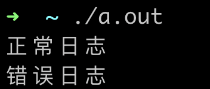
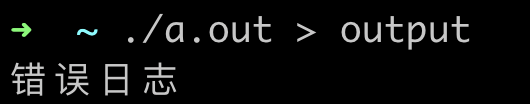
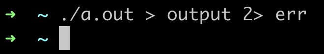

#### 7.6 错误处理 stderr 和 exit

##### stderr

前面的学习中，我们已经认识到了标准输入和标准输出，接下来要认识的是标准错误，和标准输出一样，标准错误默认也是输出到屏幕中。

###### 为什么要有标准错误

在软件开发中，难免会出现错误，比如用户输入的参数错误，文件打开失败等等，我们希望能把这些错误记录起来，以便用于后续的排查，
但是，如果直接使用标准输出来输出这些日志，那么可能会跟一些正常的日志混在一起，不便于检索，所以，如果可以将一些错误日志与正常日志区分开，
那么问题就迎刃而解了。

###### 标准错误 stderr 体验

```clike
#include <stdio.h>
#include <stdlib.h>

int main() {
    fprintf(stdout, "正常日志\n");
    
    fprintf(stderr, "错误日志\n");

    return 0;
}
```

代码说明，操作系统会为每个启动的进程自动打开 `标准输入`、`标准输出`、`标准错误`，分别对应着 `stdin`、`stdout`、`stderr` 这三个 FILE 指针。
上面的代码中，我们分别使用了 `stdout` 和 `stderr`，将日志分别输出到标准输出和标准错误中。

运行结果如下，看起来没有什么特别。



但如果把日志使用重定向保存到文件中，就会发现如下的结果，重定向后，只有"正常日志"输出到了文件中，"错误日志"输出到了屏幕中，这是因为标准输出和标准错误
是两个不同的输出流，重定向只影响标准输出，标准错误仍然输出到屏幕中。



想要把标准错误也重定向到文件中，需要使用 `2>` 重定向标准错误。



##### exit

###### 进程返回错误码

exit 用于终止程序，参数 exit_code 表示退出码，默认为 0，表示正常退出，非 0 表示异常退出。在没有学习 exit 函数之前，如果要返回一个错误码给父进程(运行 ./a.out 的 shell)，
我们只能在 main 函数中 return 非 0 值，像下面的代码。

```clike
int createError() {
    return 1;
}

int main() {
    int code;
    
    code = createError();
    
    if (code != 0) {
        return code;
    }

    return 0;
}
```

有了 exit 函数，我们就可以在 main 函数以外的函数调用直接退出程序，而不需要在 main 函数中返回错误码。

```clike
#include <stdio.h>

void func() {
    exit(1);
}

int main() {
    func();

    // 这里不会被执行，因为 func 中会执行 exit 退出程序
    printf("main\n");

    return 0;
}
```

结合 stderr 和 exit 函数，一个简单的 cat 命令最终的实现如下。

```clike
#include <stdio.h>
#include <stdlib.h>

// 这里我们第一次使用 main 函数的参数 argc 表示参数个数，argv[] 表示参数数组
int main(int argc, char *argv[]) {
    // 检查命令行参数
    if (argc < 2) {
        printf("用法: %s <文件名>\n", argv[0]);
        exit(1);
    }
    
    // 打开文件
    FILE *file = fopen(argv[1], "r");
    if (file == NULL) {
        printf("错误: 无法打开文件 '%s'\n", argv[1]);
        exit(1);
    }
    
    // 读取文件内容并输出到标准输出
    int ch;
    while ((ch = getc(file)) != EOF) {
        putchar(ch);
    }
    
    // 关闭文件
    fclose(file);
    
    return 0;
}
```

#### 7.7 行输入和行输出

##### fgets 函数

标准库提供了一个输入函数 fget，函数的参数如下：

```clike
char *fgets(char *line, int maxline, FILE *fp);
```

fgets 函数从 fp 指向的文件中读取下一个输入行（包括换行符），并将其存储在 line 中。参数 maxline 表示 line 的最大长度。
fgets函数返回一个指向 line 的指针。如果到达文件末尾或发生错误，则返回 NULL。

##### fputs 函数

与 fgets 函数类似，标准库还提供了一个输出函数 fputs，函数的参数如下：

```clike
int fputs(char *line, FILE *fp);
 ```

fputs 函数将 line 中的内容写入 fp 指向的文件中。如果发生错误，则返回 EOF，否则返回非负数。

##### 应用

下面使用 fgets 和 fputs 函数来实现 cat 命令。

```clike
#include <stdio.h>
#include <stdlib.h>

int main(int argc, char *argv[]) {
        char line[100];

            // 检查命令行参数
        if (argc < 2) {
                printf("用法: %s <文件名>\n", argv[0]);
                exit(1);
        }

        FILE *file = fopen(argv[1], "r");

        if (file == NULL) {
                fprintf(stderr, "打开文件失败\n");
                exit(1);
        }

        while (fgets(line, sizeof(100), file) != NULL) {
                fputs(line, stdout);
        }

        fclose(file);

        return 0;
}
```
