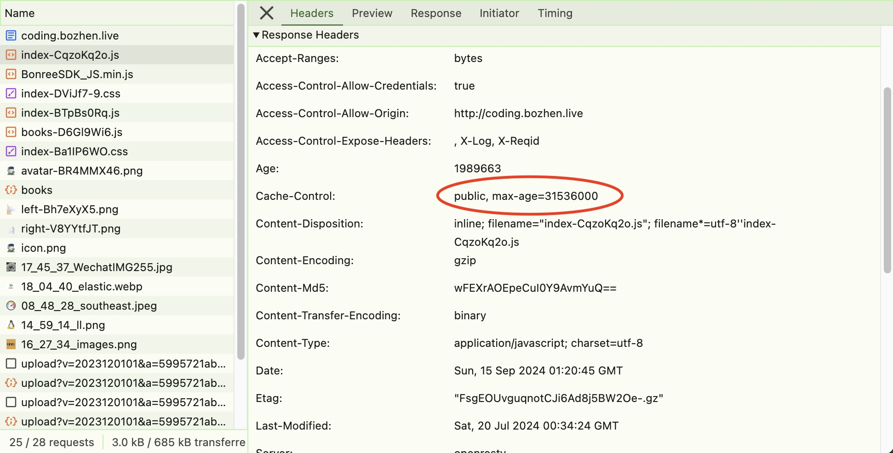

### GoAccess 简介

GoAccess - 可视化 Web 日志分析工具。

GoAccess 是一款开源(MIT许可证)的且具有交互视图界面的实时 Web 日志分析工具，分析结果可以通过你的 Web 浏览器或者 *nix 系统下的终端程序访问。

GoAccess 常见使用场景如下

1. 检查是否有异常流量（异常的 ip 访问数量、扫描不存在的路径、提交可执行脚本、可疑的 User-Agent 和 OS）
2. 检查应用流量是否合理（接口访问次数是否正常）
3. 简单的独立访问用户统计

### GoAccess 的使用

如果你的 Nginx 日志按默认格式输出，那么不需要任何配置，直接运行下面命令就可以进行日志分析。如果分析的日志为实时日志，则会把分析结果刷新到终端中。

```shell
$ goaccess your_access.log
```

分析结果


恶意流量


非法 User-Agent


### GoAccess In Action

下面以小康的一次流量优化为例，说明一下如何借助 GoAccess 找到系统中可优化的地方。

以下为小康服务器 2024-06-18 的访问记录分析结果，分析结果输出到 html 文件中。

<iframe src="../files/all.html" height="800px"></iframe>

#### 统计结果分析

根据上面的分析结果可以看到，静态资源传输流量为 125.57 GiB，占总流量约 67% 。通过对静态资源传输数据量大小进行排序，可以看到 /htnew/static/js/chunk-vendors.js 文件消耗流量最高，单个文件消耗流量 5.03 GiB。

接下来，根据上面的文件路径重新到 Nginx 日志过滤一下，可以确定其完整的访问路径。得到完整的访问路径后在浏览器中访问，可以看到 http 响应头中出现的缓存控制字段如下图所示。


由于该字段的出现，导致用户每次访问小康相关的前端页面时，都需要完整加载所有的前端资源 ( js、css、image )，无法利用客户端本身的缓存，造成用户端流量的浪费，同时也增加了服务器的带宽压力。

接下来分析一下为什么响应头中会出现 `Cache-Control: no-store, no-cache, must-revalidate, proxy-revalidate, max-age=0`。

#### 单页应用的访问

<div style="text-align: center">
    
</div>

通常情况下，当浏览器访问一个网站时，会缓存以下类型的资源以加快后续访问的速度并减少网络流量：

1. HTML 页面，主页面内容，即页面的 HTML 文件，可能会被缓存
2. CSS 文件
3. JavaScript 文件
4. 图像文件，图片资源（如 .jpg, .png, .gif, .svg 等）会被缓存，尤其是网站中的 logo、背景图等不常变化的图片。


<div style="text-align: center">
    
</div>

一切正常...

#### 版本更新

当项目组有新版本的前端资源发布时，服务器中的静态资源文件发生变更，但文件名不变（此处用 '' 表示文件内容已经发生变化）。下面是一种前端项目版本更新时用户访问出现“白屏”的可能。

<div style="text-align: center">
    
</div>

> 此时，压力来到运维同事这边...

最终，为了应对这种情况，项目组在 Nginx 中加入了 `Cache-Control: no-store, no-cache, must-revalidate, proxy-revalidate, max-age=0` 的配置，强制用户每次访问都必须重新到服务器中加载相关资源文件。

#### 解决方案---文件名变更（Step 1）

为了解决上述问题，只需要在每次发布新版本时，简单地给所有资源文件增加一个“版本号”的变数，例如 app.js 变为 app1.js，那么用户在访问时，浏览器缓存肯定不会存在 app1.js 文件。

<div style="text-align: center">
    
</div>

经过上述改造后，Nginx 中的强制刷新缓存配置已经可以去掉了...

同时，为了正常利用客户端缓存，参考“七牛 CDN”关于 Cache-Control 字段的配置如下图



在 Nginx 中加入了类似下面的配置。

```nginx.conf
location ~*\.(js|css|png|jpg)$ {
    add_header Cache-Control "public, max-age=31536000";
}
```
