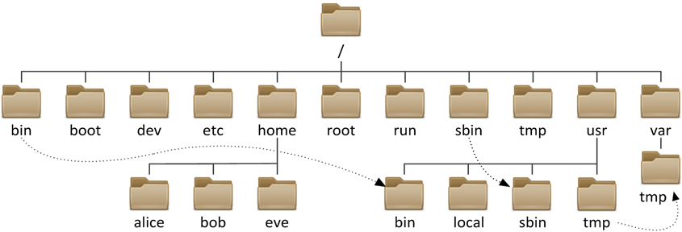

### 像黑客一样使用命令行 --- Linux 命令行入门

#### 1. 理解 Linux 文件系统树

##### Linux
以根目录（/）为起点的树形结构：Linux 文件系统采用单一的根目录，所有的文件和目录都挂载在根目录下的不同位置。例如，“/bin” 目录存放着基本的用户命令，像 “ls”“cp” 等命令的可执行文件都在这里；“/etc” 目录主要存放系统的配置文件，如网络配置文件 “/etc/network/interfaces”（在基于 Debian 的系统中）。
分区挂载灵活：可以将不同的分区挂载到根目录下的不同子目录。例如，用户可以将一个专门用于存储用户数据的分区挂载到 “/home” 目录下，这样所有用户的主目录就存储在这个分区中。

Linux 文件系统图例

##### Windows
Windows 文件系统采用磁盘分区的方式来组织文件，每个磁盘分区都对应一个磁盘驱动器，磁盘驱动器下可以包含多个目录，每个目录可以包含多个文件。

#### 2. 文件路径

##### 绝对路径

在 Linux 中，绝对路径是指从根目录（/）开始，通过一系列目录和文件名组成的路径。绝对路径的格式为：`/目录1/目录2/.../文件名` 。

##### 相对路径

在 Linux 中，相对路径是指相对于当前目录的路径。相对路径的格式为：`./当前目录/目录1/目录2/.../文件名` 。

#### 3. 什么是命令行

Linux 命令是在 Linux 操作系统环境下，用户与系统进行交互的工具。用户可以通过在终端（Terminal）中输入相应的命令，让系统执行各种任务，包括文件操作、进程管理、系统配置、网络管理等多个方面。以下对 Linux 命令的简单介绍。

#### 4. 常见命令行分类

##### 1. 文件和目录操作

* `ls`：列出当前目录下的文件和目录
* `cd` ：切换目录
* `mkdir`: 创建目录
* `rm`: 删除文件或目录
* `cp`: 复制文件或目录
* `mv`: 移动或重命名文件或目录

##### 2. 文件查看和编辑

* `cat`：查看文件内容
* `less` `more`: 分页查看文件内容
* `vim`: 文本编辑器

#### 5. 基础练习

1. 在当前目录下创建一个名为 `test_dir` 的新目录。
2. 在 `test_dir` 目录下创建一个名为 `test_file.txt` 的空文件。
3. 将 `test_file.txt` 文件复制一份，命名为 `test_file_copy.txt`。
4. 把 `test_file_copy.txt` 文件移动到当前目录下。
5. 列出 `test_dir` 目录的详细信息。
6. 删除 `test_dir` 目录下的test_file.txt文件。
7. 删除 `test_dir` 目录，若删除时遇到问题，思考如何解决并完成删除操作。

#### 6. 文件编辑器 VI

##### 为什么要学习 VI

现在这个时代存在着很多图形界⾯编辑器和易⽤的基于⽂本的编辑器，例如 nano ，那为什么还要学习 vi ？这有三条充分的理由

1. vi 总是可用的。如果用户当前的系统没有图形界面，例如是远程服务器或者是本地系统的 X 配置不可用，那么 vi 就会成为救命的稻草。尽管 nano 已经得到
越来越广泛的使用，但是，迄今为止它还不是通用的。而 POSIX（一种UNIX系统的程序兼容标准）则要求系统必须配备有 vi

2. vi 是轻量级的软件，运行速度快。对于很多任务来说，启动 vi 比在菜单中找到一个图形界面编辑器并等待几十兆大小的编辑器加载要容易得多。另外，
vi 的设计还非常利于打字。在接下来的讲解中读者可以了解到，vi 高手在编辑过程中甚至不需要把手指从键盘上移开。
 
3. ⽤户不想被其他 Linux 和 UNIX ⽤户蔑视 。

##### VI 的基本操作

* `i`：进入插入模式，在光标处开始输入新文本。
* `a`：进入插入模式，在光标后插入新文本。
* `Esc`：退出插入模式，进入正常模式。
* `:w`：保存当前文件。
* `:q`：退出当前文件。
* `:q!`：强制退出当前文件，不保存。
