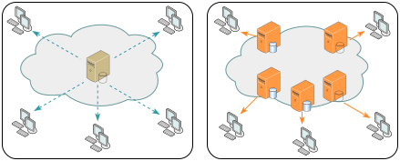
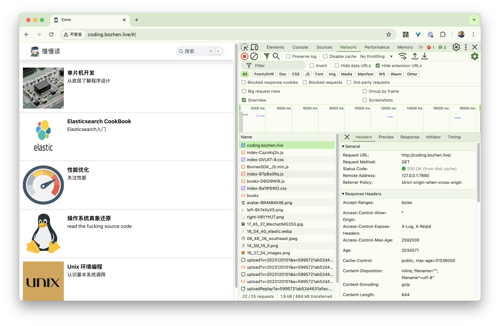
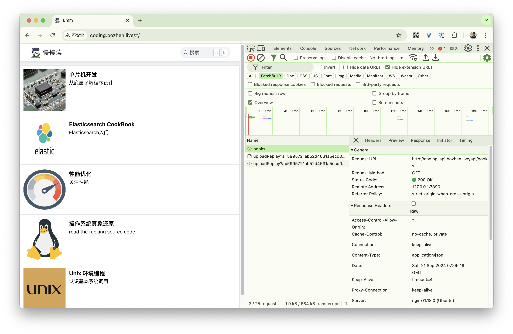
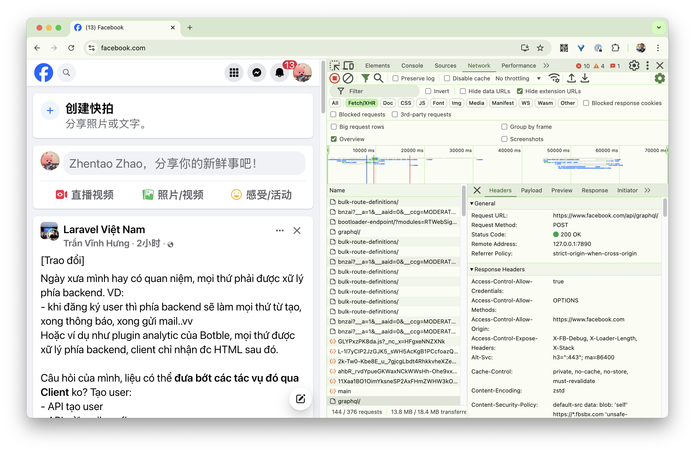
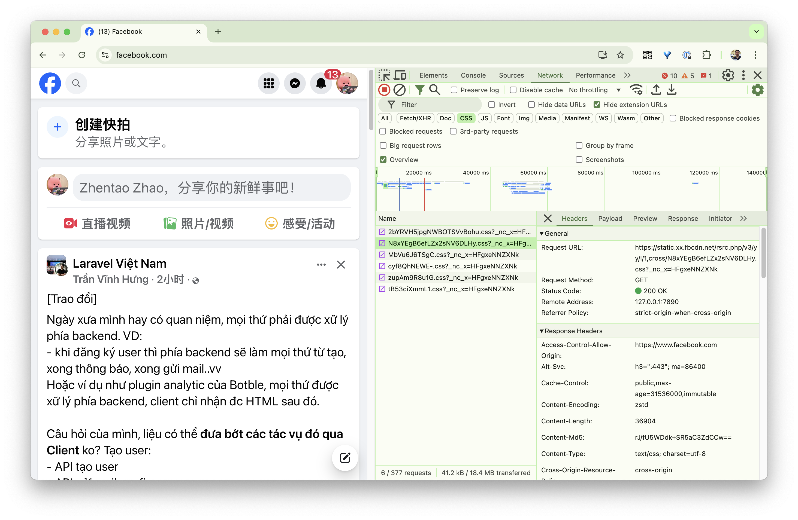
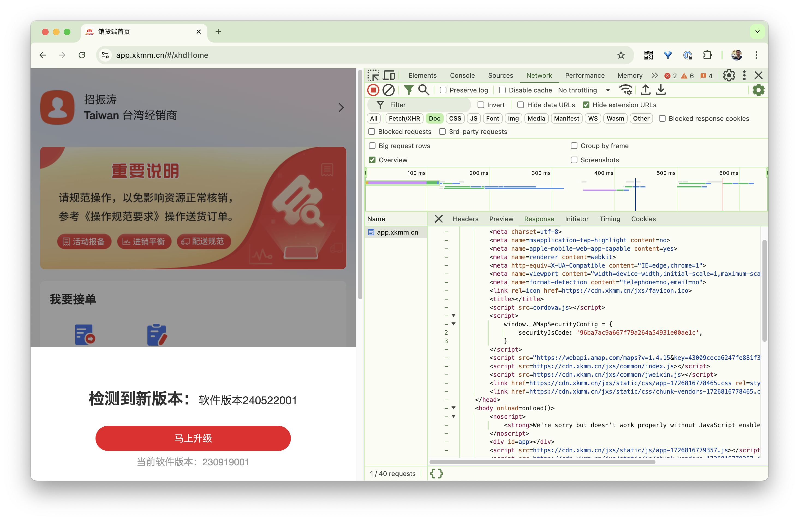
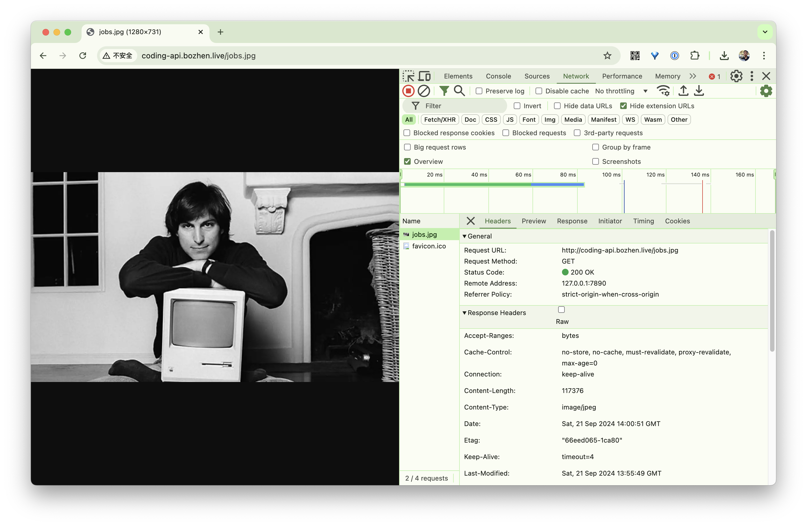
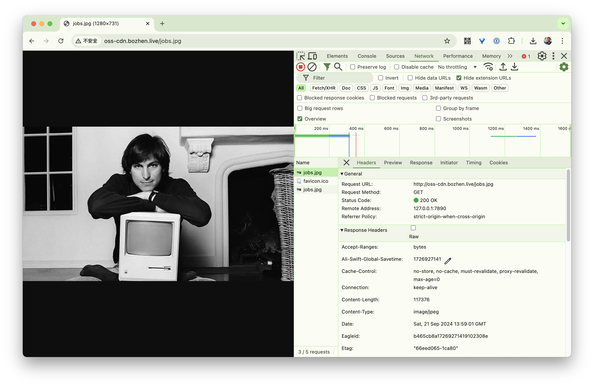
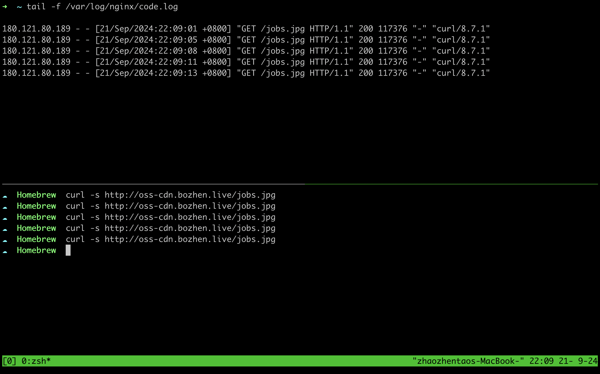
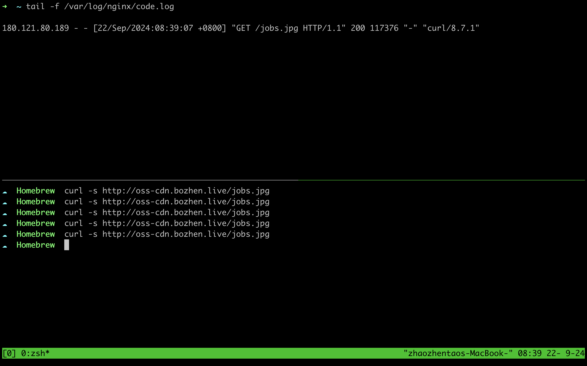

### GoAccess 简介

GoAccess - 可视化 Web 日志分析工具。

GoAccess 是一款开源(MIT许可证)的且具有交互视图界面的实时 Web 日志分析工具，分析结果可以通过你的 Web 浏览器或者 *nix 系统下的终端程序访问。

GoAccess 常见使用场景如下

1. 检查是否有异常流量（异常的 ip 访问数量、扫描不存在的路径、提交可执行脚本、可疑的 User-Agent 和 OS）
2. 检查应用流量是否合理（接口访问次数是否正常）
3. 简单的独立访问用户统计

### GoAccess 的使用

如果你的 Nginx 日志按默认格式输出，那么不需要任何配置，直接运行下面命令就可以进行日志分析。如果分析的日志为实时日志，则会把分析结果刷新到终端中。

```bash
$ goaccess your_access.log
```

分析结果


恶意流量


非法 User-Agent


### GoAccess In Action

下面以小康的一次流量优化为例，说明一下如何借助 GoAccess 找到系统中可优化的地方。

以下为小康服务器 2024-06-18 的访问记录分析结果，分析结果输出到 html 文件中。

<iframe src="../files/all.html" height="800px"></iframe>

#### 统计结果分析

根据上面的分析结果可以看到，静态资源传输流量为 125.57 GiB，占总流量约 67% 。通过对静态资源传输数据量大小进行排序，可以看到 /htnew/static/js/chunk-vendors.js 文件消耗流量最高，单个文件消耗流量 5.03 GiB。

接下来，根据上面的文件路径重新到 Nginx 日志过滤一下，可以确定其完整的访问路径。得到完整的访问路径后在浏览器中访问，可以看到 http 响应头中出现的缓存控制字段如下图所示。


由于该字段的出现，导致用户每次访问小康相关的前端页面时，都需要完整加载所有的前端资源 ( js、css、image )，无法利用客户端本身的缓存，造成用户端流量的浪费，同时也增加了服务器的带宽压力。

接下来分析一下为什么响应头中会出现 `Cache-Control: no-store, no-cache, must-revalidate, proxy-revalidate, max-age=0`。

##### 单页应用的访问

<div style="text-align: center">
    
</div>

通常情况下，当浏览器访问一个网站时，会缓存以下类型的资源以加快后续访问的速度并减少网络流量：

1. HTML 页面，主页面内容，即页面的 HTML 文件，可能会被缓存
2. CSS 文件
3. JavaScript 文件
4. 图像文件，图片资源（如 .jpg, .png, .gif, .svg 等）会被缓存，尤其是网站中的 logo、背景图等不常变化的图片。


<div style="text-align: center">
    
</div>

一切正常...

##### 版本更新

当项目组有新版本的前端资源发布时，服务器中的静态资源文件发生变更，但文件名不变（此处用 '' 表示文件内容已经发生变化）。下面是一种前端项目版本更新时用户访问出现“白屏”的可能。

<div style="text-align: center">
    
</div>

> 此时，压力来到运维同事这边...

最终，为了应对这种情况，项目组在 Nginx 中加入了 `Cache-Control: no-store, no-cache, must-revalidate, proxy-revalidate, max-age=0` 的配置，强制用户每次访问都必须重新到服务器中加载相关资源文件。

#### 解决方案 

##### 1 文件名变更

为了解决上述问题，只需要在每次发布新版本时，简单地给所有资源文件增加一个“版本号”的变数，例如 app.js 变为 app1.js，那么用户在访问时，浏览器缓存肯定不会存在 app1.js 文件。

<div style="text-align: center">
    
</div>

经过上述改造后，Nginx 中的强制刷新缓存配置已经可以去掉了，并且发布新版本时也不会再出现“白屏”的问题。

> 还有更好的做法吗？

##### 2 客户端缓存

浏览器的缓存机制几乎是在万维网刚刚诞生时就已经存在，在 HTTP 协议设计之初，便确定了服务端与客户端之间“无状态”（Stateless）的交互原则，即要求每次请求是独立的，
每次请求无法感知也不能依赖另一个请求的存在。但无状态并不只有好的一面，由于每次请求都是独立的，服务端不保存此前请求的状态和资源，
所以也不可避免地导致其携带有重复的数据，造成网络性能降低。HTTP 协议对此问题的解决方案便是客户端缓存，在 HTTP 从 1.0 到 1. 1，再到 2.0 版本
的每次演进中，逐步形成了现在被称为“状态缓存” 、 “强制缓存”（许多资 料中简称为“强缓存”）和“协商缓存”的 HTTP 缓存机制。

###### 强制缓存

HTTP 的强制缓存对一致性处理的策略就如它的名字一样，十分直接：假设在某个时点到来以前，譬如收到响应后的 10 分钟内，资源的内容和状态一定不会被改变，
因此客户端可以无须经过任何请求，在该时点前一直持有和使用该资源的本地缓存副本。

根据约定，强制缓存在浏览器的地址输入、页面链接跳转、新开窗口、前进和后退中均可生效，但在用户主动刷新页面时应当自动失效。HTTP 协议中设有以下两类 Header 实现强制缓存。

1.Expires

Expires 是 HTTP/1.0 协议中开始提供的 Header，后面跟随一个截至时间参数。当服务器返回某个资源时带有该 Header 的话，意味着服务器承诺截止时间之前资源不会发生变动，
浏览器可直接缓存该数据，不再重新发请求，示例

```http
HTTP/1.1 200 OK
Expires: Wed, 8 Apr 2020 07:28:00 GMT
```

Expires 是 HTTP 协议最初版本中提供的缓存机制，设计非常直观易懂，但考虑得并不够周全，它至少存在以下显而易见的问题：

* 受限于客户端的本地时间。譬如，在收到响应后，客户端修改了本地时间，将时间前后调整几分钟，就可能会造成缓存提前失效或超期持有。
 
* 无法处理涉及到用户身份的私有资源，譬如，某些资源被登录用户缓存在自己的浏览器上是合理的，但如果被代理服务器或者内容分发网络缓存起来，则可能被其他未认证的用户所获取。

2.Cache-Control

Cache-Control 是 HTTP/1.1 协议中定义的强制缓存 Header，它的语义比起 Expires 来说就丰富了很多，如果 Cache-Control 和 Expires 同时存在，
并且语义存在冲突（譬如 Expires 与 max-age / s-maxage 冲突）的话，规定必须以 Cache-Control 为准。Cache-Control 的使用示例如下：

```http
HTTP/1.1 200 OK
Cache-Control: max-age=600
```

Cache-Control 在客户端的请求 Header 或服务器的响应 Header 中都可以存在，它定义了一系列的参数，且允许自行扩展（即不在标准 RFC 协议中，
由浏览器自行支持的参数），其标准的参数主要包括有：

* max-age 和 s-maxage：max-age 后面跟随一个以秒为单位的数字，表明相对于请求时间（在 Date Header 中会注明请求时间）多少秒以内缓存是有效的，
资源不需要重新从服务器中获取。相对时间避免了 Expires 中采用的绝对时间可能受客户端时钟影响的问题。s-maxage 中的“s”是“Share”的缩写，
意味“共享缓存”的有效时间，即允许被 CDN、代理等持有的缓存有效时间，用于提示 CDN 这类服务器应在何时让缓存失效。
 
* public 和 private：指明是否涉及到用户身份的私有资源，如果是 public，则可以被代理、CDN 等缓存，如果是 private，则只能由用户的客户端进行私有缓存。
no-cache 和 no-store：no-cache 指明该资源不应该被缓存，哪怕是同一个会话中对同一个 URL 地址的请求，也必须从服务端获取，令强制缓存完全失效，
但此时下一节中的协商缓存机制依然是生效的；no-store 不强制会话中相同 URL 资源的重复获取，但禁止浏览器、CDN 等以任何形式保存该资源。

* no-transform：禁止资源被任何形式地修改。譬如，某些 CDN、透明代理支持自动 GZip 压缩图片或文本，以提升网络性能，而 no-transform 就禁止了这样的行为，
它要求 Content-Encoding、Content-Range、Content-Type 均不允许进行任何形式的修改。

* min-fresh 和 only-if-cached：这两个参数是仅用于客户端的请求 Header。min-fresh 后续跟随一个以秒为单位的数字，用于建议服务器能返回一个不少于该时间的缓存资
源（即包含 max-age 且不少于 min-fresh 的数字）。only-if-cached 表示客户端要求不必给它发送资源的具体内容，此时客户端就仅能使用事先缓存的资源来进行响应，
若缓存不能命中，就直接返回 503/Service Unavailable 错误。

* must-revalidate 和 proxy-revalidate：must-revalidate 表示在资源过期后，一定需要从服务器中进行获取，即超过了 max-age 的时间后，就等同于 no-cache 的行为，
proxy-revalidate 用于提示代理、CDN 等设备资源过期后的缓存行为，除对象不同外，语义与 must-revalidate 完全一致。

###### 协商缓存

强制缓存是基于时效性的，但无论是人还是服务器，其实多数情况下都并没有什么把握去承诺某项资源多久不会发生变化。另外一种基于变化检测的缓存机制，
在一致性上会有比强制缓存更好的表现，但需要一次变化检测的交互开销，性能上就会略差一些，这种基于检测的缓存机制，通常被称为“协商缓存”。另外，
应注意在 HTTP 中协商缓存与强制缓存并没有互斥性，这两套机制是并行工作的，譬如，当强制缓存存在时，直接从强制缓存中返回资源，无须进行变动检查；
而当强制缓存超过时效，或者被禁止（no-cache / must-revalidate），协商缓存仍可以正常地工作。协商缓存有两种变动检查机制，分别是根据资源的修改时间进行检查，
以及根据资源唯一标识是否发生变化来进行检查，它们都是靠一组成对出现的请求、响应 Header 来实现的：

* **Last-Modified** 和 **If-Modified-Since**：Last-Modified 是服务器的响应 Header，用于告诉客户端这个资源的最后修改时间。对于带有这个 Header 的资源，
当客户端需要再次请求时，会通过 If-Modified-Since 把之前收到的资源最后修改时间发送回服务端。
<br/>如果此时服务端发现资源在该时间后没有被修改过，就只要返回一个 304/Not Modified 的响应即可，无须附带消息体，达到节省流量的目的，如下所示：
```http
HTTP/1.1 304 Not Modified
Cache-Control: public, max-age=600
Last-Modified: Wed, 8 Apr 2020 15:31:30 GMT
```
如果此时服务端发现资源在该时间之后有变动，就会返回 200/OK 的完整响应，在消息体中包含最新的资源，如下所示：
```http
HTTP/1.1 200 OK
Cache-Control: public, max-age=600
Last-Modified: Wed, 8 Apr 2020 15:31:30 GMT
Content
```

* **Etag** 和 **If-None-Match**：Etag 是服务器的响应 Header，用于告诉客户端这个资源的唯一标识。HTTP 服务器可以根据自己的意愿来选择如何生成这个标识，譬如 Apache 
服务器的 Etag 值默认是对文件的索引节点（INode），大小和最后修改时间进行哈希计算后得到的。对于带有这个 Header 的资源，当客户端需要再次请求时，
会通过 If-None-Match 把之前收到的资源唯一标识发送回服务端。
<br/>如果此时服务端计算后发现资源的唯一标识与上传回来的一致，说明资源没有被修改过，就只要返回一个 304/Not Modified 的响应即可，无须附带消息体，达到节省流量的目的，如下所示：
```http
HTTP/1.1 304 Not Modified
Cache-Control: public, max-age=600
ETag: "28c3f612-ceb0-4ddc-ae35-791ca840c5fa"
```
如果此时服务端发现资源的唯一标识有变动，就会返回 200/OK 的完整响应，在消息体中包含最新的资源，如下所示：
```http
HTTP/1.1 200 OK
Cache-Control: public, max-age=600
ETag: "28c3f612-ceb0-4ddc-ae35-791ca840c5fa"
Content
```
Etag 是 HTTP 中一致性最强的缓存机制，譬如，Last-Modified 标注的最后修改只能精确到秒级，如果某些文件在 1 秒钟以内，被修改多次的话，
它将不能准确标注文件的修改时间；又或者如果某些文件会被定期生成，可能内容并没有任何变化，但 Last-Modified 却改变了，导致文件无法有效使用缓存，
这些情况 Last-Modified 都有可能产生资源一致性问题，只能使用 Etag 解决。
<br/>Etag 却又是 HTTP 中性能最差的缓存机制，体现在每次请求时，服务端都必须对资源进行哈希计算，这比起简单获取一下修改时间，开销要大了很多。Etag 和 Last-Modified 
是允许一起使用的，服务器会优先验证 Etag，在 Etag 一致的情况下，再去对比 Last-Modified，这是为了防止有一些 HTTP 服务器未将文件修改日期纳入哈希范围内。

###### 方案

基于前面的处理办法（每次发布新版本变更前端资源文件名），我们选用“强制缓存”方案，通过 Cache-Control 指定资源文件的缓存时间，这样可以最大限度减少请求数量（连 304 Not Modified 的请求都没有了）。

在 Nginx 中加入了类似下面的配置即可完成客户端缓存的启用。

```nginx.conf
location ~*\.(js|css|png|jpg)$ {
    add_header Cache-Control "public, max-age=31536000";
}
```

##### 3 CDN

经过前面两个步骤的处理，对于每个独立用户来说，平均访问速度已经得到很大的改善（特别是已经建立了缓存的用户），对服务器来说平均每天访问量（静态资源部分）降低了 30% 以上。
假如没有新版本发布，这部分流量将会逐渐变得越来越少，直到所有用户都缓存了相关的前端资源。

但实际上目前每个版本的发布依然比较频繁，还没等到所有用户都建立好缓存，新的版本又发布了...（所以前面只观察到 30% 的下降），对于这部分流量最好的优化方案是 CDN 。

> 内容分发网络（英语：Content Delivery Network或Content Distribution Network，缩写：CDN）是指一种透过互联网互相连接的电脑网络系统，利用最靠近每位用户的服务器，更快、更可靠地将音乐、图片、影片、应用程序及其他文件发送给用户，来提供高性能、可扩展性及低成本的网络内容传递给用户。 --- 维基百科

<div style="text-align: center">
    
</div>

###### 方案

对于前端静态资源来说，利用 CDN 一般有以下两种做法：

1. 将所有静态资源都放置到 CDN 中，包括 HTML、CSS、JS 和各种图片资源文件，然后通过不同的域名去请求 API 。
2. 将除了 HTML 文件外的静态资源放置到 CDN 中，API 和 HTML 文件同源（域名相同）。

以个人网站为例，采用的是方案 1 ，所有的静态资源包括 HTML、CSS、JS 都通过一个 CDN 域名 coding.bozhen.live 去加载，
API 动态请求则通过另一个域名 coding-api.bozhen.live 去加载，完全的动静分离。

<div style="text-align: center">
    
</div>

<div style="text-align: center">
    
</div>

> 需要注意的是，因为网站加载域名为 coding.bozhen.live ，所以通过 coding-api.bozhen.live 发起请求时，会有跨域的问题，API 服务器需要允许来自 coding.bozhen.live 的请求。

以 facebook 为例，采用的是方案 2 （也是大多数网站的做法），入口 HTML 文件通过 www.facebook.com 域名加载，API 通过 www.fackbook.com/api 请求（同源，不需要处理跨域问题），
其余文件通过 static.xx.fbcdn.net 域名加载。

<div style="text-align: center">
    
</div>

<div style="text-align: center">
    
</div>

在我们的项目中，网站和 API 都已经是通过相同的域名 app.xkmm.cn 去请求，如果采用方案 1 ，会涉及如下改动：

1. 创建一个新的二级域名放置所有静态资源，比如 xxx.xkmm.cn ，同时需要更改公众号菜单入口或其他会跳转到该网站的链接地址（还可能涉及部分已经安装到用户手机中的 app 需要更新）。
2. 原来的 app.xkmm.cn 背后的 N 个 API 服务器需要配置允许来自 xxx.xkmm.cn 的请求。
3. N 个业务小程序需要配置 xxx.xkmm.cn 的白名单，才能正常访问。

可以看出方案 1 涉及的改动点多，且容易遗漏，改动成本大。

如果采用方案 2 ，改动点则少得多，只需要把 CSS、JS 和图片等静态资源，放置到 CDN 中，通过 HTML 直接引用 CDN 资源即可，也是最终采用的方案。

<div style="text-align: center">
    
</div>

经过这几个步骤的改造后，每天请求数量平均减少 100 万以上，流量减少约 50G 。

###### CDN 与回源

CDN 获取源站资源的过程被称为“内容分发” ，目前主要有以下两种主流的内容分发方式：

1. 主动分发（Push）分发由源站主动发起，将内容从源站或者其他资源库推送到用户边缘的各个 CDN 缓存节点上。
2. 被动回源（Pull）被动回源由用户访问所触发全自动、双向透明的资源缓存过程。当某个资源首次被用户请求的时候，CDN 缓存节点发现自己没有该资源，就会实时从源站中获取。

我们的阿里云 CDN 服务采用的是第二种方式。

> 对于“CDN 如何管理（更新）资源”这个问题，同样没有统一的标准可言，尽管在 HTTP 协议中，关于缓存的 Header 定义中确实是有对 CDN 这类共享缓存的一些指引性参数，
譬如 Cache-Control 的 s-maxage，但是否要遵循，完全取决于 CDN 本身的实现策略。更令人感到无奈的是，由于大多数网站的开发和运维人员并不十分了解 HTTP 缓存机制，
所以导致如果 CDN 完全照着 HTTP Headers 来控制缓存失效和更新，效果反而会相当的差，还可能引发其他问题。因此，CDN 缓存的管理就不存在通用的准则。---《凤凰架构》

接下来请看下面一个例子：一源地址为 http://coding-api.bozhen.live/jobs.jpg 的图片资源，通过 CDN 地址 http://oss-cdn.bozhen.live/jobs.jpg 加速。
在源站中，加入和前面类似的 Nginx 配置。

```conf
location ~*\.(js|css|png|jpg)$ {
    add_header Cache-Control "no-store, no-cache, must-revalidate, proxy-revalidate, max-age=0";
}
```

在浏览器直接访问源站地址 http://coding-api.bozhen.live/jobs.jpg 可以看到如下情况。

<div style="text-align: center">
    
</div>

通过 CDN 加速地址 http://oss-cdn.bozhen.live/jobs.jpg 访问可以看到如下情况。

<div style="text-align: center">
    
</div>

通过 CDN 地址加载的图片，和通过源站加载的地址返回着一样的 Cache-Control 响应头...

有察觉到什么问题了吗？

通过命令行工具 curl 去加载一下 CDN 加速地址，同时观察源站的 Nginx 日志可以看到如下情况：

<div style="text-align: center">
    
</div>

通过 CDN 地址访问 5 次图片，Nginx 中就有 5 次访问记录！也就是说 CDN 并没有真正起到缓存作用，用户的每一次访问都发生了回源操作，用户请求“穿透”到了源站服务器。

可以看出，阿里云 CDN 本身的缓存策略，也受 Cache-Control 的影响，因为源站返回的资源带有 Cache-Control: no-store, no-cache, must-revalidate, proxy-revalidate, max-age=0 响应头，
所以 CDN 节点也没有把资源缓存起来，最终导致用户每次的访问都会产生回源操作。

处理办法和前面一样，在 Nginx 中加入相关的 Cache-Control 配置后，重新通过 CDN 路径去访问图片，只有第一次访问时，发生了回源操作，后续访问直接从 CDN 返回资源，不再经过源站服务器。

<div style="text-align: center">
    
</div>

#### 成果

1. https://app.xkmm.cn 、https://app1.xkmm.cn 前端资源转移到 CDN 中。
2. https://ht.xkmm.cn 、https://ht1.xkmm.cn 因部分用户只能在内网中访问，前端资源未转移到 CDN ，但已正常启用客户端缓存。
3. 原本通过 https://images.xkmm.cn 下载的 Android APK 安装包转移到 CDN 中。

目前剩余最大流量接口 https://api.xkmm.cn/showPic2 正在优化中。

> 最好的性能来自消灭不必要的工作 ---《性能之巅》
