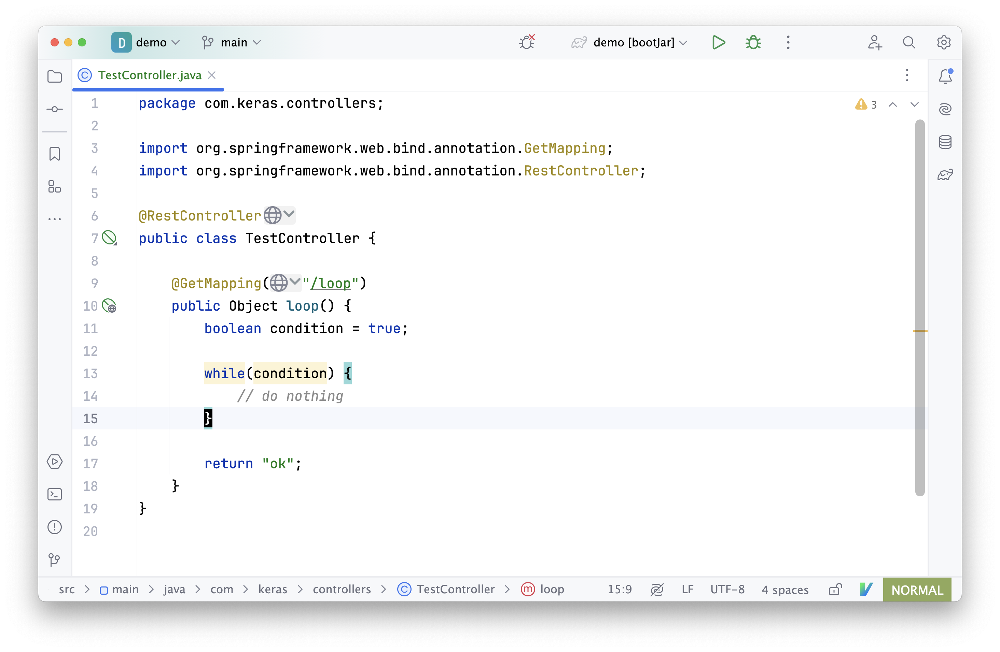
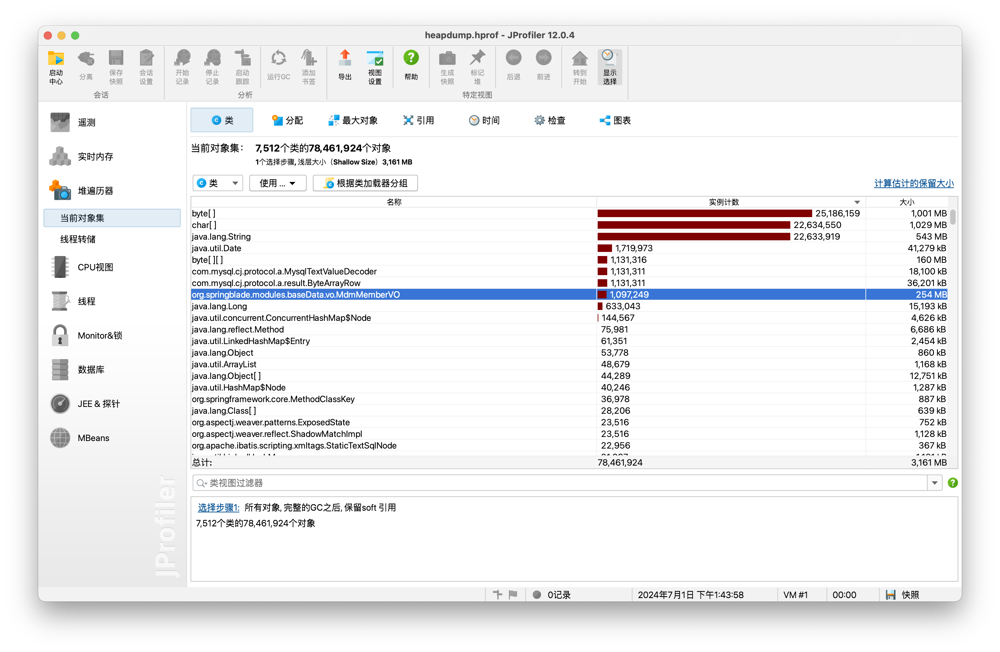
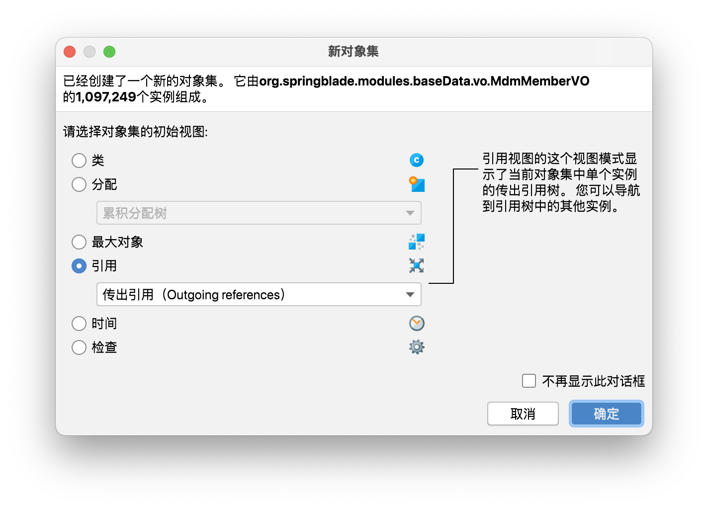
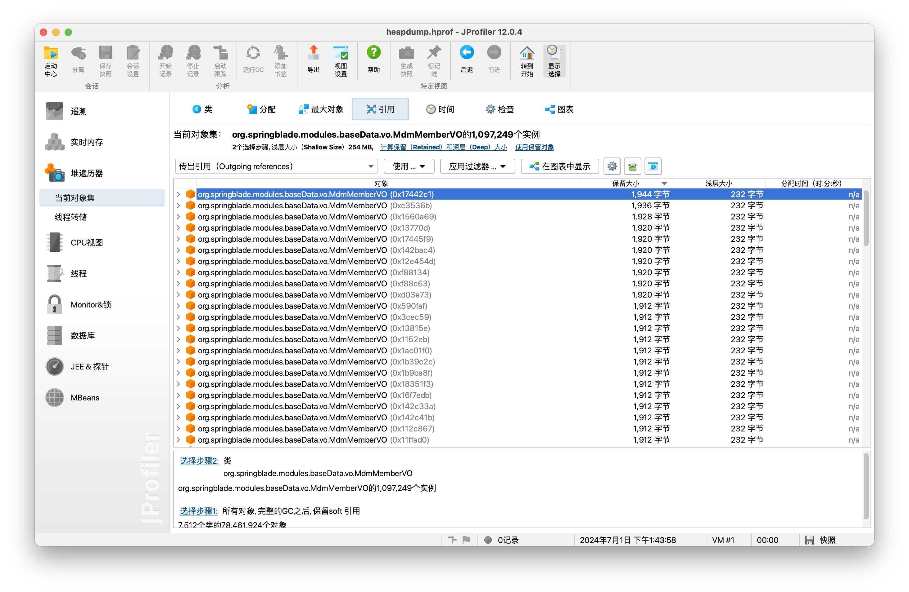
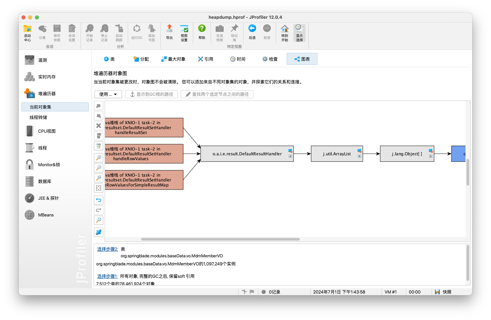
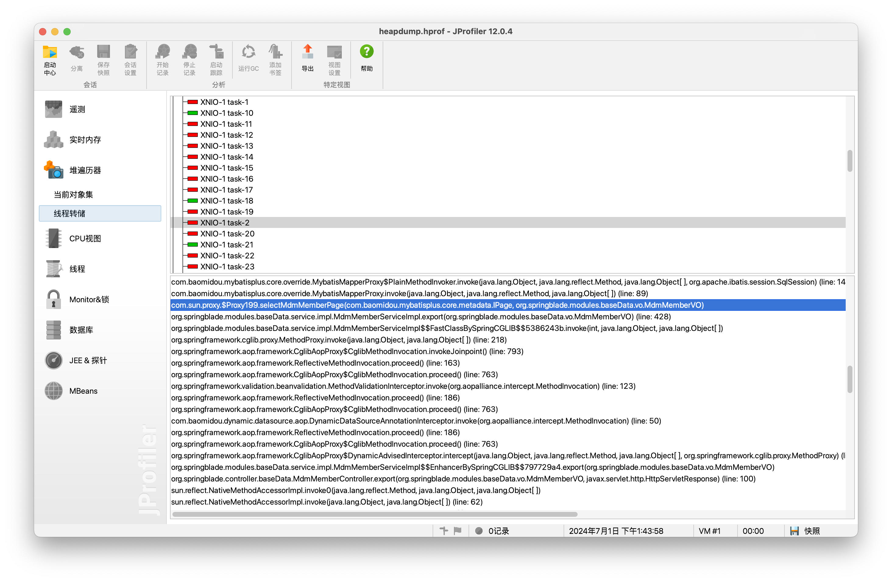
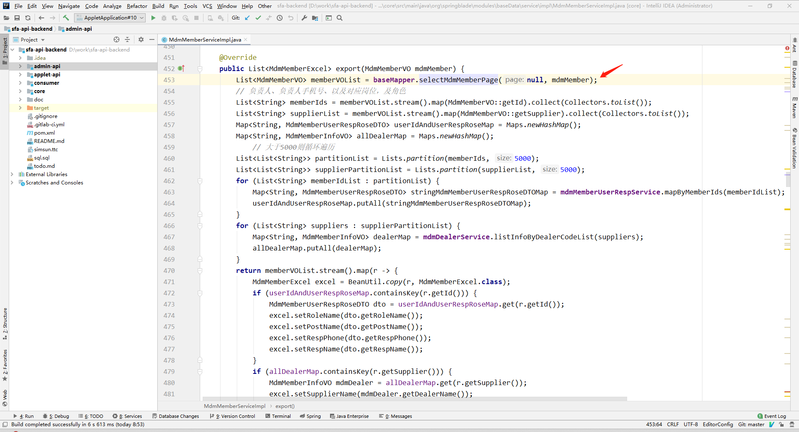

### Java 进程问题排查三板斧

### 案例

7 月 1 日，突然收到一告警信息，内容如下。

<div style="text-align: center">
    
</div>

接下来围绕 Java 开发中，最常见的两种线上问题（高 <font style="color: red">CPU</font> / <font style="color: red">内存</font> 消耗），介绍几种排查工具和使用方法。

下面通过一个模拟案例，说明一下如何排查 Java 进程中的高 CPU 消耗情况。

<div style="text-align: center">
    
</div>

### 常规处理办法

#### 1 找出占用 CPU 的线程

##### htop

借助 top 或 htop 等工具，找出具体占用 CPU 高的进程/线程。

如果服务器中有 htop ，可以通过打开 tree view 和显示线程名，看到如下内容。

<div style="text-align: center">
    
</div>

> 启动 htop 后，大写 S，勾选 `Display options` 然后勾选 `Tree View` 和 `Show custom thread names` 可以看到进程下产生的线程状态。

##### top

如果服务器中没有 htop ，也可以借助基本的 top ，先找出占用 CPU 高的进程号。

<div style="text-align: center">
    
</div>

然后通过 top -p {pid} -H ，可以找出该进程下的线程使用 CPU 情况。

<div style="text-align: center">
    
</div>

最终，通过 htop 或 top 都找到了线程 654769 正在产生高的 CPU 消耗。

#### 2 检查线程状态

经过第 1 步后，通常已经可以找出产生高 CPU 消耗的线程，然后使用 jdk 自带的工具 jstack 查看线程状态。

```bash
$ jstack 654733 | grep -A 10 9fdb1
```

> 上面的命令中 654733 为 java 进程号，9fdb1 为线程号 654769 的 16 进制显示

<div style="text-align: center">
    
</div>

### Useful Scripts

#### show-busy-java-threads

前面基于 top 和 jstack 的排查过程基本够用，但步骤略繁琐，更简单的是借助其他现成的工具比如 github 上的一个开源项目 [useful-scripts](https://github.com/oldratlee/useful-scripts) 中的一个脚本 show-busy-java-threads ，
该脚本可以通过一行命令的操作就完成前面通过 top 和 jstack 的几步操作。

下面是一个简单的示例，通过一条命令找出之前的繁忙线程。

```bash
$ ./show-busy-java-threads 3 10 -c 5 -a top.log
```

每 3 秒刷新一次，一共执行 10 次，获取 CPU 消耗 top 5 的线程状态，结果保存到 top.log 文件中。

<div style="text-align: center">
    
</div>

命令执行完后，检查输出的 top.log 文件，可以看到繁忙线程的信息。

<div style="text-align: center">
    
</div>

### Arthas 阿尔萨斯

Arthas 是一款线上监控诊断产品，通过全局视角实时查看应用 load、内存、gc、线程的状态信息，并能在不修改应用代码的情况下，对业务问题进行诊断，
包括查看方法调用的出入参、异常，监测方法执行耗时，类加载信息等，大大提升线上问题排查效率。

#### 安装与启动

```bash
$ curl -O https://arthas.aliyun.com/arthas-boot.jar

$ java -jar arthas-boot.jar
```

arthas-boot 运行起来后，选择需要诊断的 Java 进程 attach，成功后就可以看到如下图所示。

<div style="text-align: center">
    
</div>

#### 使用 Arthas 查看繁忙线程

和前面一样，接下来看看如何利用 Arthas 查找 Java 进程中的繁忙线程。

在 Arthas 控制台中，输入不带参数的命令 thread ，可以看到 JVM 中的线程，默认按 CPU 耗时降序排列。

```bash
$ thread
```

<div style="text-align: center">
    
</div>

找到最繁忙的线程 id 后，输入下面命令可以看到具体线程状态。

```bash
$ thread id
```

<div style="text-align: center">
    
</div>

#### 停止

Arthas 通过增强类来实现 Java 进程的诊断，在诊断完毕后，需要调用下面命令，重置掉所有增强类。

```bash
$ stop
```

### 内存问题分析

在 Java 中进行内存 dump（即 heap dump）通常用于调试内存泄漏或优化内存使用。你可以通过多种方法来生成 Java 进程的内存 dump，通常可以使用以下两种方法：

1. 使用 jmap 生成 heap dump ，jmap -dump:live,format=b,file={heap_dump_path} {pid}
2. 使用 JVM 参数生成内存 dump，-XX:+HeapDumpOnOutOfMemoryError -XX:HeapDumpPath=/path/to/dump

生成 dump file 后，可以借助一些可视化工具去排查具体问题，下面是 JProfiler 简单使用介绍，以 7 月 1 日生成的 heap dump 文件为例。

1. 先查找业务代码相关的类，检查有没有实例数量特别大的（根据经验，业务代码出错的可能性更大，更容易产生大量实例）。下图可以看到 `MdmMemberVO` 实例数量超过 100W ，很不正常。

<div style="text-align: center">
    
</div>

2. 查找大实例对象的出处，双击上图的 `MdmMemberVO` 一行。

<div style="text-align: center">
    
</div>

选中其中一个对象后 “在图表中显示” 查看对象的引用情况。

<div style="text-align: center">
    
</div>

已经可以看到该对象的引用由一个 ArrayList 对象持有，ArrayList 又被 DefaultResultHandler 持有。

<div style="text-align: center">
    
</div>

最后，根据上图中的线程堆栈和线程转储，分析一下产生这个实例的具体代码行。

<div style="text-align: center">
    
</div>

最终，定位到代码中这个位置。这个位置导出了数据库中超过 100 万记录的数据。

<div style="text-align: center">
    
</div>

### Just for fun
