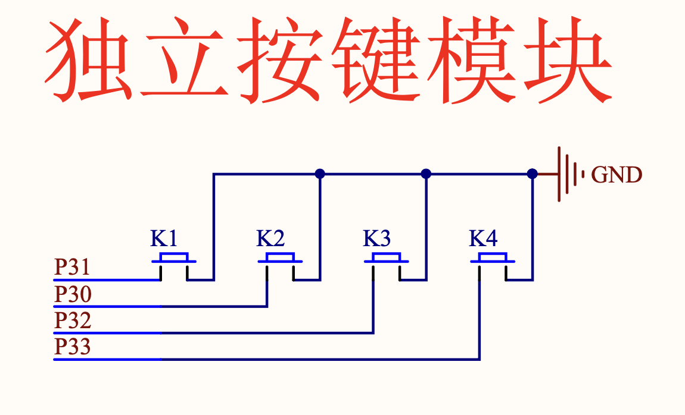

### 独立按键

前面的课程中主要使用了 IO 口的输出功能，本节课程将使用 IO 口的输入功能来实现独立按键的功能。

#### 独立按键的原理

从原理图中可以看出，独立按键一端接的是 P3.x IO 口，另一端接的是 GND，当按键按下时，P3.x IO 口的电平会被拉低，当按键松开时，P3.x IO 口恢复高电平。
所以只需要`读取` P3.x IO 口的电平状态，就可以知道按钮是否被按下。

本节的重点就是 `读取` IO 口的电平状态。



```clike
#include "reg52.h"

typedef unsigned int u16;
typedef unsigned char u8;

sbit KEY1 = P3^1;
sbit KEY2 = P3^0;
sbit KEY3 = P3^2;
sbit KEY4 = P3^3;

sbit LED1 = P2^0;

#define KEY1_PRESS 1
#define KEY2_PRESS 2
#define KEY3_PRESS 3
#define KEY4_PRESS 4
#define KEY_UNPRESS 0

void delay_10us(u16 tenus) {
  while (tenus--);
}

u8 key_scan(u8 mode) {
  static u8 key = 1;

  if (mode) key = 1; // 连续扫描按键

  // 任意按键按下
  // 这里的 KEY1 == 0 实际上就是先"读取"了 P3.1 IO 口的电平状态，然后再与 0 进行比较
  if (key == 1 && (KEY1 == 0 || KEY2 == 0 || KEY3 == 0 || KEY4 == 0)) {
    delay_10us(1000);
    key=0;

    if (KEY1 == 0)
      return KEY1_PRESS;
    
    if (KEY2 == 0)
      return KEY2_PRESS;

    if (KEY3 == 0)
      return KEY3_PRESS;

    if (KEY4 == 0)
      return KEY4_PRESS;
  } else if (KEY1 == 1 && KEY2 == 1 && KEY3 == 1 && KEY4 == 1) {
    key = 1;
  }
  return KEY_UNPRESS;
}

void main() {
  u8 key;

  while (1) {
    // 获取按下的按键
    key = key_scan(0);

    if (key == KEY1_PRESS) {
      LED1 = !LED1;
    }
  }
}
```

### 练习

通过四个按键，分别控制四个 LED 灯的亮灭。

### 矩阵按钮

```clike
#include "reg52.h"

typedef unsigned int u16;
typedef unsigned char u8;

#define KEY_MATRIX_PORT	P1

#define SMG_A_DP_PORT	P0

u8 gsmg_code[17]={0x3f,0x06,0x5b,0x4f,0x66,0x6d,0x7d,0x07,
				0x7f,0x6f,0x77,0x7c,0x39,0x5e,0x79,0x71};	

void delay_10us(u16 ten_us)
{
	while(ten_us--);	
}

u8 key_matrix_ranks_scan(void)
{
	u8 key_value=0;

	KEY_MATRIX_PORT=0xf7;
	if(KEY_MATRIX_PORT!=0xf7)
	{
		delay_10us(1000);
		switch(KEY_MATRIX_PORT)
		{
			case 0x77: key_value=1;break;
			case 0xb7: key_value=5;break;
			case 0xd7: key_value=9;break;
			case 0xe7: key_value=13;break;
		}
	}
	while(KEY_MATRIX_PORT!=0xf7);
	
	KEY_MATRIX_PORT=0xfb;
	if(KEY_MATRIX_PORT!=0xfb)
	{
		delay_10us(1000);
		switch(KEY_MATRIX_PORT)
		{
			case 0x7b: key_value=2;break;
			case 0xbb: key_value=6;break;
			case 0xdb: key_value=10;break;
			case 0xeb: key_value=14;break;
		}
	}
	while(KEY_MATRIX_PORT!=0xfb);
	
	KEY_MATRIX_PORT=0xfd;
	if(KEY_MATRIX_PORT!=0xfd)
	{
		delay_10us(1000);
		switch(KEY_MATRIX_PORT)
		{
			case 0x7d: key_value=3;break;
			case 0xbd: key_value=7;break;
			case 0xdd: key_value=11;break;
			case 0xed: key_value=15;break;
		}
	}
	while(KEY_MATRIX_PORT!=0xfd);
	
	KEY_MATRIX_PORT=0xfe;
	if(KEY_MATRIX_PORT!=0xfe)
	{
		delay_10us(1000);
		switch(KEY_MATRIX_PORT)
		{
			case 0x7e: key_value=4;break;
			case 0xbe: key_value=8;break;
			case 0xde: key_value=12;break;
			case 0xee: key_value=16;break;
		}
	}
	while(KEY_MATRIX_PORT!=0xfe);
	
	return key_value;		
}

u8 key_matrix_flip_scan(void)
{
	static u8 key_value=0;

	KEY_MATRIX_PORT=0x0f;
	if(KEY_MATRIX_PORT!=0x0f)
	{
		delay_10us(1000);
		if(KEY_MATRIX_PORT!=0x0f)
		{
			KEY_MATRIX_PORT=0x0f;
			switch(KEY_MATRIX_PORT)
			{
				case 0x07: key_value=1;break;
				case 0x0b: key_value=2;break;
				case 0x0d: key_value=3;break;
				case 0x0e: key_value=4;break;
			}

			KEY_MATRIX_PORT=0xf0;
			switch(KEY_MATRIX_PORT)
			{
				case 0x70: key_value=key_value;break;
				case 0xb0: key_value=key_value+4;break;
				case 0xd0: key_value=key_value+8;break;
				case 0xe0: key_value=key_value+12;break;
			}
			while(KEY_MATRIX_PORT!=0xf0);
		}
	}
	else
		key_value=0;		
	
	return key_value;		
}

void main()
{	
	u8 key=0;

	while(1)
	{
	   	key=key_matrix_ranks_scan();
		if(key!=0)
			SMG_A_DP_PORT=gsmg_code[key-1];
	}		
}
```
