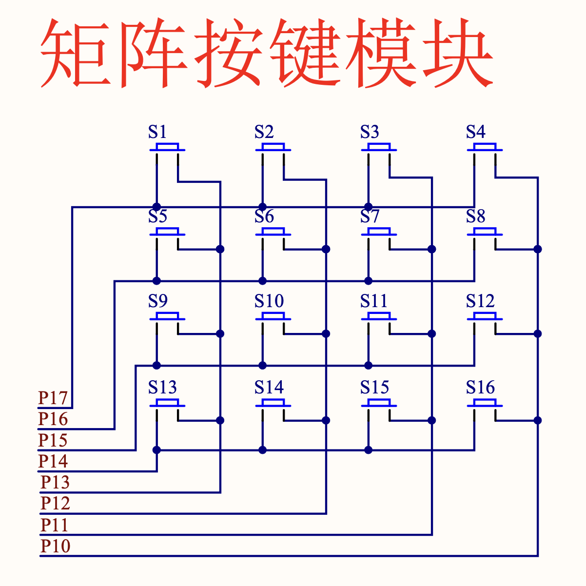

### 矩阵键盘

前面的课程，学习了独立键盘，每个按键对应一个引脚，通过检测引脚的电平状态来判断按键是否被按下。

独立键盘的缺点是：
- 占用引脚多
- 按键数量有限

矩阵键盘是一种将独立键盘的多个按键连接到一起的键盘，通过扫描矩阵的每个按键来判断按键是否被按下。
矩阵键盘的优点是：
- 占用引脚少
- 按键数量多

### 矩阵键盘原理图



矩阵键盘由行和列组成，矩阵键盘的扫描方法有两种：行扫描和列扫描。

### 实验代码

```clike
#include "reg52.h"

typedef unsigned int u16;
typedef unsigned char u8;

#define KEY_MATRIX_PORT P1    // 矩阵键盘端口

#define SMG_A_DP_PORT P0      // 数码管端口

// 共阴极数码管显示 0~F 的段码数据
u8 gsmg_code[17] = {
	0x3f,
	0x06,
	0x5b,
	0x4f,
	0x66,
	0x6d,
	0x7d,
	0x07,
	0x7f,
	0x6f,
	0x77,
	0x7c,
	0x39,
	0x5e,
	0x79,
	0x71
};

void delay_10us(u16 ten_us)
{
	while (ten_us--);
}

// 矩阵键盘列式扫描
u8 key_matrix_ranks_scan(void)
{
	u8 key_value = 0;

	KEY_MATRIX_PORT = 0xf7;      // 给第一列赋值0，其余全为1
	if (KEY_MATRIX_PORT != 0xf7) // 判断第一列按键是否按下
	{
		delay_10us(1000);        // 消抖
		switch (KEY_MATRIX_PORT) // 保存第一列按键按下后的键值
		{
			case 0x77:
				key_value = 1;
				break;
			case 0xb7:
				key_value = 5;
				break;
			case 0xd7:
				key_value = 9;
				break;
			case 0xe7:
				key_value = 13;
				break;
		}
	}
	while (KEY_MATRIX_PORT != 0xf7); // 等待按键松开

	KEY_MATRIX_PORT = 0xfb;          // 给第二列赋值0，其余全为1
	if (KEY_MATRIX_PORT != 0xfb)     // 判断第二列按键是否按下
	{
		delay_10us(1000);            // 消抖
		switch (KEY_MATRIX_PORT)     // 保存第二列按键按下后的键值
		{
			case 0x7b:
				key_value = 2;
				break;
			case 0xbb:
				key_value = 6;
				break;
			case 0xdb:
				key_value = 10;
				break;
			case 0xeb:
				key_value = 14;
				break;
		}
	}
	while (KEY_MATRIX_PORT != 0xfb);   // 等待按键松开

	KEY_MATRIX_PORT = 0xfd;            // 给第三列赋值0，其余全为1
	if (KEY_MATRIX_PORT != 0xfd)       // 判断第三列按键是否按下
	{
		delay_10us(1000);              // 消抖
		switch (KEY_MATRIX_PORT)       // 保存第三列按键按下后的键值
		{
			case 0x7d:
				key_value = 3;
				break;
			case 0xbd:
				key_value = 7;
				break;
			case 0xdd:
				key_value = 11;
				break;
			case 0xed:
				key_value = 15;
				break;
		}
	}
	while (KEY_MATRIX_PORT != 0xfd);    // 等待按键松开

	KEY_MATRIX_PORT = 0xfe;             // 给第四列赋值0，其余全为1
	if (KEY_MATRIX_PORT != 0xfe)        // 判断第四列按键是否按下
	{
		delay_10us(1000);               // 消抖
		switch (KEY_MATRIX_PORT)        // 保存第四列按键按下后的键值
		{
			case 0x7e:
				key_value = 4;
				break;
			case 0xbe:
				key_value = 8;
				break;
			case 0xde:
				key_value = 12;
				break;
			case 0xee:
				key_value = 16;
				break;
		}
	}
	while (KEY_MATRIX_PORT != 0xfe);    // 等待按键松开

	return key_value;
}

u8 key_matrix_flip_scan(void)
{
	static u8 key_value = 0;

	KEY_MATRIX_PORT = 0x0f;             // 给所有行赋值0，列全为1
	if (KEY_MATRIX_PORT != 0x0f)        // 判断按键是否按下
	{
		delay_10us(1000);               // 消抖
		if (KEY_MATRIX_PORT != 0x0f)
		{
			// 测试列
			KEY_MATRIX_PORT = 0x0f;
			switch (KEY_MATRIX_PORT)    // 保存行为0，按键按下后的列值
			{
				case 0x07:
					key_value = 1;
					break;
				case 0x0b:
					key_value = 2;
					break;
				case 0x0d:
					key_value = 3;
					break;
				case 0x0e:
					key_value = 4;
					break;
			}
			// 测试行
			KEY_MATRIX_PORT = 0xf0;
			switch (KEY_MATRIX_PORT)   // 保存列为0，按键按下后的键值
			{
				case 0x70:
					key_value = key_value;
					break;
				case 0xb0:
					key_value = key_value + 4;
					break;
				case 0xd0:
					key_value = key_value + 8;
					break;
				case 0xe0:
					key_value = key_value + 12;
					break;
			}
			while (KEY_MATRIX_PORT != 0xf0); // 等待按键松开
		}
	}
	else
		key_value = 0;

	return key_value;
}

void main()
{
	u8 key = 0;

	while (1)
	{
		key = key_matrix_ranks_scan();
		if (key != 0)
			SMG_A_DP_PORT = gsmg_code[key - 1]; // 得到的按键值减1换算成数组下标对应0-F段码
	}
}
```

### 矩阵键盘视频

https://www.bilibili.com/video/BV1kj411T7c3/?spm_id_from=333.337.search-card.all.click&vd_source=b8ed8b20bb8136e36167e41851432be8