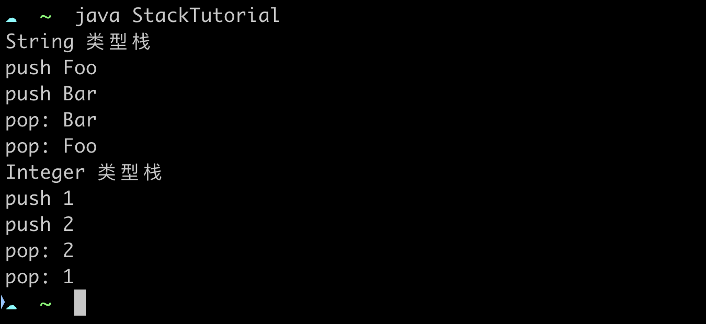
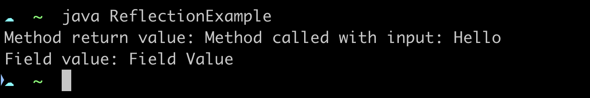

### 泛型编程

编写通用栈类，支持泛型操作（栈的操作：`push` 和 `pop`）。

示例：创建两种不同类型的栈，进行 push 和 pop 操作。



### 反射

使用反射机制动态加载类，调用方法并获取属性值。

使用反射，为下面的类创建一个实例，调用 `myMethod` 和访问 `myField` 变量。

```java
class MyClass {

    private String myField = "Field Value";

    private String myMethod(String input) {
        return "Method called with input: " + input;
    }
}
```

示例：


