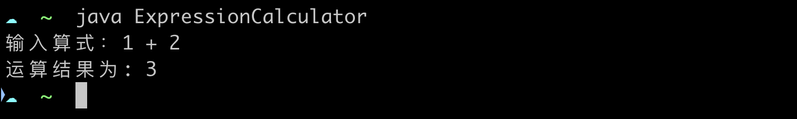
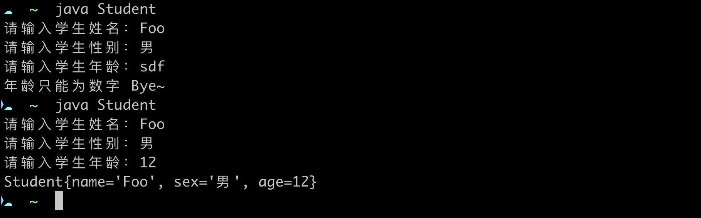

### 基础语法练习

#### 编写一个简单的计算器程序，支持基本运算

要求：接收一个简单的数学表达式（只需要支持两个操作数，加减乘除操作符），运行计算出结果。

例子：



提示：可以使用下面模板接收输入的字符串。

```java
import java.util.Scanner;

public class ExpressionCalculator {

    public static void main(String[] args) {
        Scanner scanner = new Scanner(System.in);
        
        String expression = scanner.nextLine();
        
        scanner.close();
    }
}
```

### 面向对象编程

要求：创建学生类，包含属性和方法，能够添加、删除、查询学生信息。

示例：



需要对数据类型有基本的判断。

### 常用类库

要求：使用 Java 标准库的日期和时间类，格式化输出当前日期和时间。

示例：


