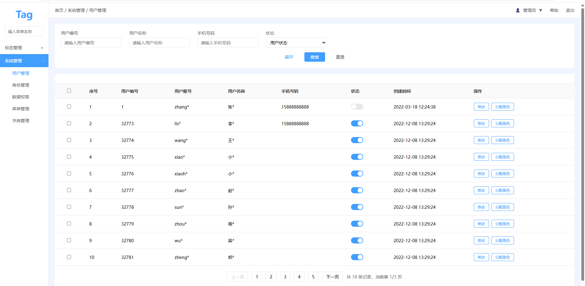
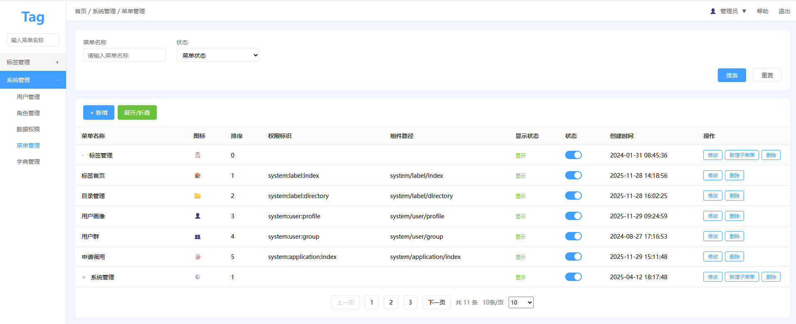
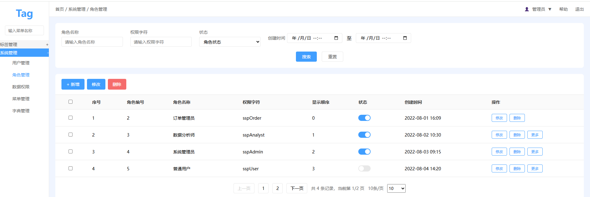
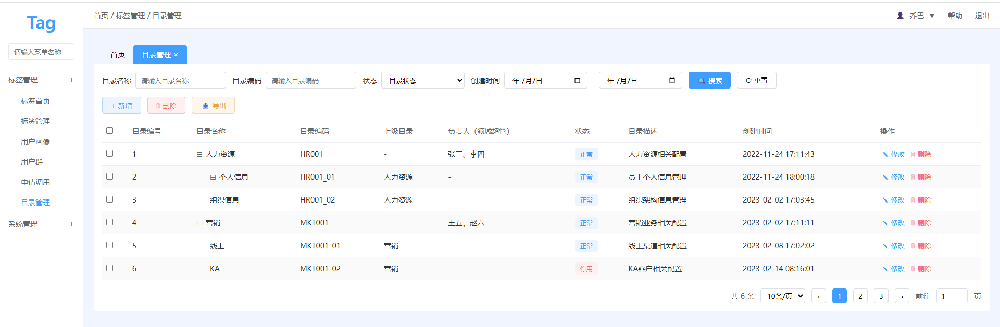
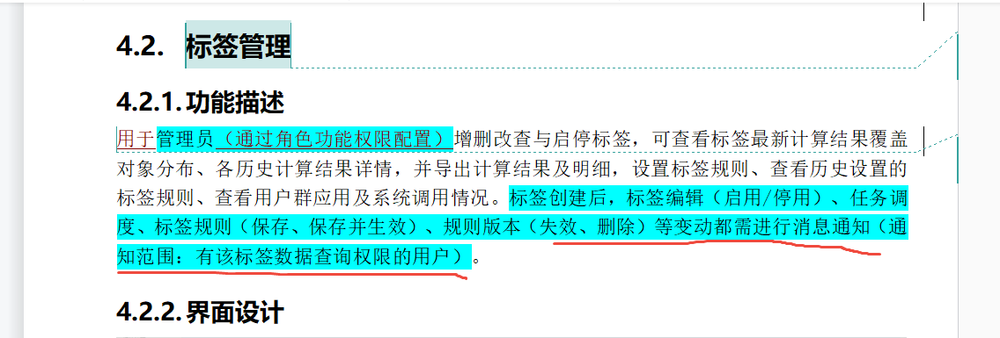
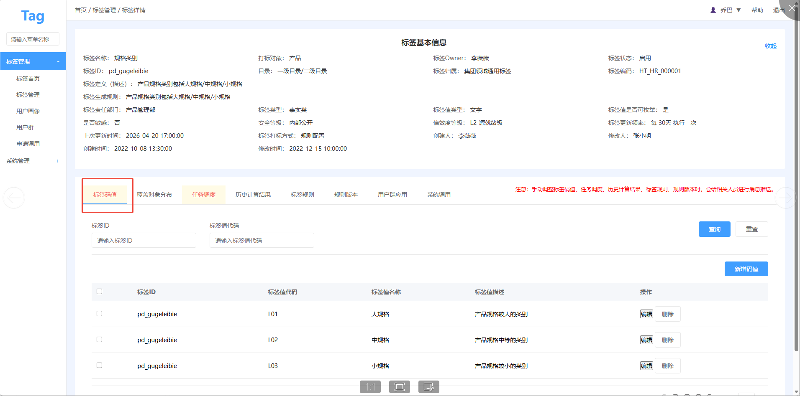
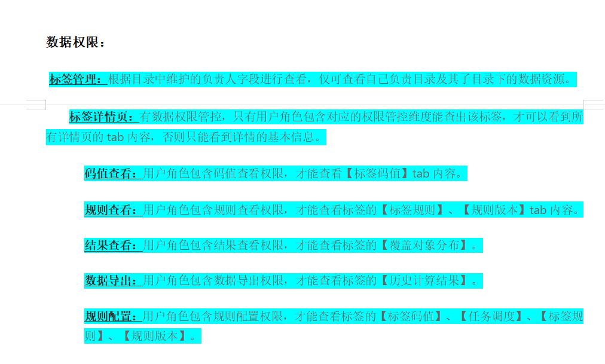
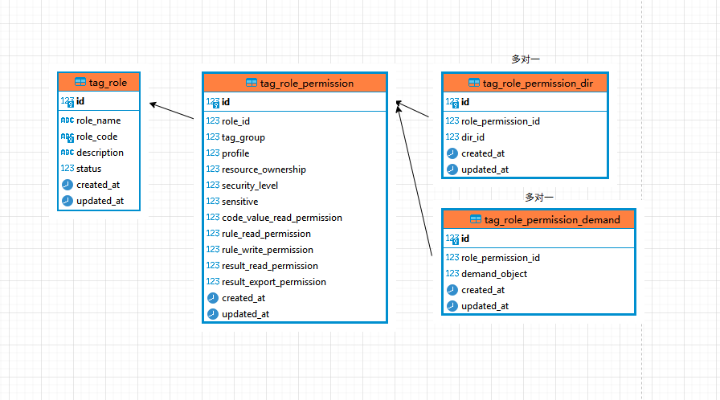

### 1 用户管理

#### 1.1表结构

```sql
CREATE TABLE `users` (
  `id` int unsigned NOT NULL AUTO_INCREMENT,
  `emplid` varchar(11) NOT NULL COMMENT '员工ID',
  `oprid` varchar(30) NOT NULL COMMENT '帐号ID',
  `name` varchar(255) NOT NULL COMMENT '真实姓名',
  `status` tinyint DEFAULT '0' COMMENT '状态: 0 不启用, 1 启用, 标签系统自维护',
  `created_at` timestamp NULL DEFAULT NULL,
  `updated_at` timestamp NULL DEFAULT NULL,
  PRIMARY KEY (`id`)
) ENGINE=InnoDB COMMENT='用户';
```

#### 1.2用户数据来源

用户数据通过 `MDM` 系统推送 `人员` 数据，`标签系统` 按表结构接收所需字段。

> MDM测试环境: http://10.254.2.37:8282/#/login, 账号: `hadaytest`, 密码: `haday@123`。

`MDM` 数据对接流程:
1. 标签系统开发人员在标签系统中创建一个 http 接口接收 `MDM` 推送的数据, post 方法。

   http 接口实现参考代码。

   ```java
   @PostMapping("/xxx")
   public Object sync(@RequestBody List<MdsMdmPersonalDto> body) {
       // todo insert or update
   }

   @Data
   public class MdsMdmPersonalDto {

       // MDM 员工ID，主键
       @JsonProperty("emplid")
       String emplId;

       // 账号ID
       @JsonProperty("oprid")
       String oprId;

       // 真实姓名
       @JsonProperty("name")
       String name;
   }
   ```
   
   > 注意：数据新增和修改均通过此接口，需要处理创建和修改逻辑。

2. 由招振涛将接口注册到 `ESB` 和 `MDM` 系统。
3. 在 `MDM` 系统触发数据推送，操作方式可咨询招振涛。

#### 1.3管理页面的查询修改

按照原型实现用户的 `查询` 、 `状态修改` 、 `角色分配`。



### 2 菜单管理

#### 2.1表结构

```sql
-- 后台菜单表
CREATE TABLE `sys_menu` (
`id` bigint NOT NULL AUTO_INCREMENT COMMENT '菜单ID（主键）',
`parent_id` bigint NOT NULL DEFAULT 0 COMMENT '父菜单ID，0=顶级菜单',
`menu_name` varchar(50) NOT NULL COMMENT '菜单名称',
`menu_type` char(1) NOT NULL DEFAULT 'C' COMMENT '菜单类型：M=目录，C=菜单，B=按钮',
`path` varchar(200) DEFAULT '' COMMENT '路由地址（前端路径）',
`component` varchar(255) DEFAULT '' COMMENT '组件路径（前端文件地址）',
`icon` varchar(100) DEFAULT '' COMMENT '菜单图标',
`sort` int NOT NULL DEFAULT 0 COMMENT '显示排序（数字越小越靠前）',
`status` tinyint NOT NULL DEFAULT 1 COMMENT '状态：0=禁用，1=启用',
`visible` tinyint NOT NULL DEFAULT 1 COMMENT '是否显示：0=隐藏，1=显示',
`is_frame` tinyint NOT NULL DEFAULT 0 COMMENT '是否外链：0=否，1=是',
`created_at` datetime DEFAULT CURRENT_TIMESTAMP COMMENT '创建时间',
`updated_at` datetime DEFAULT CURRENT_TIMESTAMP ON UPDATE CURRENT_TIMESTAMP COMMENT '更新时间',
PRIMARY KEY (`id`) USING BTREE,
KEY `idx_parent_id` (`parent_id`) USING BTREE
) ENGINE=InnoDB COMMENT='后台菜单权限表';
```

#### 2.2菜单的增删查改页面



### 3 角色 / 角色菜单管理

#### 3.1表结构

```sql
CREATE TABLE `tag_role` (
`id` int NOT NULL AUTO_INCREMENT COMMENT '角色ID（主键）',
`role_name` varchar(50) NOT NULL COMMENT '角色名称',
`role_code` varchar(50) NOT NULL COMMENT '角色唯一标识',
`description` varchar(255) DEFAULT NULL COMMENT '角色描述/备注',
`status` tinyint NOT NULL DEFAULT '1' COMMENT '状态: 0 禁用, 1 启用 ',
`created_at` DATETIME NOT NULL DEFAULT CURRENT_TIMESTAMP COMMENT '创建时间',
`updated_at` DATETIME NOT NULL DEFAULT CURRENT_TIMESTAMP ON UPDATE CURRENT_TIMESTAMP COMMENT '更新时间',
PRIMARY KEY (`id`),
UNIQUE KEY `uk_role_code` (`role_code`) COMMENT '角色标识唯一'
) ENGINE=InnoDB COMMENT='角色';

-- 角色与菜单对应表（多对多关系）
CREATE TABLE `sys_role_menu` (
  `id` bigint NOT NULL AUTO_INCREMENT COMMENT '主键ID',
  `role_id` bigint NOT NULL COMMENT '角色ID',
  `menu_id` bigint NOT NULL COMMENT '菜单ID',
  `create_at` datetime DEFAULT CURRENT_TIMESTAMP COMMENT '创建时间',
  PRIMARY KEY (`id`) USING BTREE,
  UNIQUE KEY `uk_role_menu` (`role_id`,`menu_id`) COMMENT '防止重复授权',
  KEY `idx_role_id` (`role_id`) USING BTREE,
  KEY `idx_menu_id` (`menu_id`) USING BTREE
) ENGINE=InnoDB COMMENT='角色菜单关联表';
```

#### 3.2角色的增删查改页面

根据原型实现相关功能



### 4 目录管理

#### 4.1表结构

```sql
-- 目录表
CREATE TABLE `sys_directory` (
`id` INT NOT NULL AUTO_INCREMENT COMMENT '主键ID',
`directory_name` VARCHAR(100) NOT NULL COMMENT '目录名称',
`directory_code` VARCHAR(50) NOT NULL COMMENT '目录编码（唯一）',
`parent_id` BIGINT DEFAULT NULL COMMENT '上级目录ID（自关联，顶级目录为NULL或0）',
`full_path` VARCHAR(500) NOT NULL DEFAULT '' COMMENT '树路径，格式：/父ID/子ID/.../当前ID/',
`status` TINYINT NOT NULL DEFAULT 1 COMMENT '状态：0-停用, 1-正常',
`description` VARCHAR(500) DEFAULT NULL COMMENT '目录描述',
`create_time` DATETIME NOT NULL DEFAULT CURRENT_TIMESTAMP COMMENT '创建时间',
`update_time` DATETIME NOT NULL DEFAULT CURRENT_TIMESTAMP ON UPDATE CURRENT_TIMESTAMP COMMENT '更新时间',
PRIMARY KEY (`id`),
UNIQUE KEY `uk_directory_code` (`directory_code`),
KEY `idx_parent_id` (`parent_id`),
KEY `idx_status` (`status`)
) ENGINE=InnoDB COMMENT='目录管理表';

-- 用户与负责目录关联表（多对多）
CREATE TABLE `sys_user_directory` (
`id` INT NOT NULL AUTO_INCREMENT COMMENT '主键ID',
`user_id` INT NOT NULL COMMENT '用户ID',
`directory_id` INT NOT NULL COMMENT '目录ID（对应sys_directory.id）',
`create_time` DATETIME NOT NULL DEFAULT CURRENT_TIMESTAMP COMMENT '创建时间',
PRIMARY KEY (`id`),
UNIQUE KEY `uk_user_directory` (`user_id`,`directory_id`) COMMENT '防止重复授权',
KEY `idx_user_id` (`user_id`),
KEY `idx_directory_id` (`directory_id`)
) ENGINE=InnoDB COMMENT='用户负责目录表';
```

#### 4.2目录的增删查改页面



根据原型实现:
1. 新增目录
2. 列表查询
3. 删除
4. 修改
5. 导出 (导出格式未定义)

### 5 组织架构数据对接

创建标签需要设置所属部门，因此需要对接部门数据。暂定按照下面字段接收数据，需要增加字段时再补充。

#### 5.1表结构

```sql
CREATE TABLE `department` (
  `id` int NOT NULL AUTO_INCREMENT COMMENT '主键id',
  `deptid` varchar(8) DEFAULT NULL COMMENT '部门ID',
  `deptid_all` varchar(255) DEFAULT NULL COMMENT '部门全路径',
  `descr` varchar(30) DEFAULT NULL COMMENT '部门名称',
  `descr_all` varchar(1000) DEFAULT NULL COMMENT '部门全称',
  `part_deptid` varchar(8) DEFAULT NULL COMMENT '直接上级部门',
  `dc_dept_level` varchar(4) DEFAULT NULL COMMENT '架构层级',
  `dc_seq` decimal(12,0) DEFAULT NULL COMMENT '排序码',
  `comments` varchar(1000) DEFAULT NULL COMMENT '备注',
  `is_del` tinyint unsigned DEFAULT NULL COMMENT '是否删除 1是 0否',
  `eff_status` varchar(1) DEFAULT NULL COMMENT '状态',
  PRIMARY KEY (`id`)
) ENGINE=InnoDB COMMENT='MDM-部门-基础视图';
```

#### 5.2数据来源

用户数据通过 `MDM` 系统推送 `部门` 数据，`标签系统` 按表结构接收所需字段。

对接过程参考用户数据接收过程 [点击跳转](#1.2用户数据来源), 此处不重复说明。

### 6 标签首页

根据原型实现目录首页:
1. 目录树
2. 在目录树中点击某个目录，加载目录下的标签
3. 目录中的标签排序

> 注意: 首页的新增标签和排序，目录管理人和上级目录管理人才展示 (李冲补充的要求)

### 7 标签管理(对应需求文档中 4.2)

#### 7.1推送说明



消息通知功能在下面的 Service 中可以找到，根据文档中的推送时机调用消息推送接口（注意修改推送人员，目前是写死的）。

```java
package com.haday.tp.tag.server.service;


import com.haday.tp.tag.server.enums.TagMajorCategory;
import com.haday.tp.tag.server.service.message.MessageType;

public interface MsgService {

   public void send(MessageType messageType, TagMajorCategory tagMajorCategory, String tagGroupId);
}
```

#### 7.2码值查询

根据原型和表结构实现相关功能。



```sql
-- 码值表

CREATE TABLE `tag_code_value` (
`id` bigint NOT NULL AUTO_INCREMENT,
`tag_id` int NOT NULL COMMENT 't_tag_base_info 表 id',
`code` varchar(20) DEFAULT NULL COMMENT '标签值代码',
`code_value` varchar(20) DEFAULT NULL COMMENT '标签值代码显示文本',
`description` varchar(20) DEFAULT NULL COMMENT '码值描述',
`created_at` DATETIME NOT NULL DEFAULT CURRENT_TIMESTAMP COMMENT '创建时间',
`updated_at` DATETIME NOT NULL DEFAULT CURRENT_TIMESTAMP ON UPDATE CURRENT_TIMESTAMP COMMENT '更新时间',
PRIMARY KEY (`id`),
KEY `idx_tag_id` (`tag_id`)
) ENGINE=InnoDB COMMENT='标签目录关系表';
```

#### 7.3新增标签

这次的版本新增标签增加了字段。

1. 标签 owner，单选，字段直接增加到 `tag_base_info` 表中。
2. 标签目录，单选，字段直接增加到 `tag_base_info` 表中。
3. 标签归属，单选，字段直接增加到 `tag_base_info` 表中。
4. 标签编码，系统生成，字段直接增加到 `tag_base_info` 表中。
5. 标签生成规则，系统生成，字段直接增加到 `tag_base_info` 表中。
6. 责任部门，单选，字段直接增加到 `tag_base_info` 表中。
7. 标签值是否可枚举，单选，字段直接增加到 `tag_base_info` 表中。
8. 是否敏感，单选，字段直接增加到 `tag_base_info` 表中。
9. 安全等级，单选，字段直接增加到 `tag_base_info` 表中。
10. 信效度等级，单选，字段直接增加到 `tag_base_info` 表中。
11. 需求系统类型，多选，需要改为字典，需要一个新表来保存一对多关系，目前是用一个字段逗号分割保存。

#### 7.4页面权限

根据角色拥有的权限来显示页面内容。



##### 7.4.1表结构

```sql
CREATE TABLE `tag_role_permission` (
`id` bigint NOT NULL AUTO_INCREMENT,
`role_id` bigint NOT NULL COMMENT '角色 ID',
`tag_group` tinyint NOT NULL COMMENT '标签/群组选项: 0 关闭, 1 打开',
`profile` tinyint NOT NULL COMMENT '画像: 0 关闭, 1 打开',
`resource_ownership` tinyint NOT NULL DEFAULT '0' COMMENT '标签归属: 0 未定义, 1 集团通用, 2 集团领域通用',
`security_level` tinyint NOT NULL DEFAULT '0' COMMENT '标签归属: 0 未定义, 1 外部公开, 2 内部公开, 3 企业秘密, 4 企业机密, 5 企业绝密',
`sensitive` tinyint NOT NULL DEFAULT '0' COMMENT '是否敏感: 0 不敏感, 1 敏感',
`code_value_read_permission` tinyint NOT NULL COMMENT '码值查看权限: 0 关闭, 1 打开。只有在 tag_group 才可能设置为 1, tag_group 关闭时设置为 0',
`rule_read_permission` tinyint NOT NULL COMMENT '规则查看权限: 0 关闭, 1 打开。只有在 tag_group 才可能设置为 1, tag_group 关闭时设置为 0',
`rule_write_permission` tinyint NOT NULL COMMENT '规则修改权限: 0 关闭, 1 打开。只有在 tag_group 才可能设置为 1, tag_group 关闭时设置为 0',
`result_read_permission` tinyint NOT NULL COMMENT '结果查看权限: 0 关闭, 1 打开。只有在 tag_group 才可能设置为 1, tag_group 关闭时设置为 0',
`result_export_permission` tinyint NOT NULL COMMENT '结果导出权限: 0 关闭, 1 打开。只有在 tag_group 才可能设置为 1, tag_group 关闭时设置为 0',
`created_at` DATETIME NOT NULL DEFAULT CURRENT_TIMESTAMP COMMENT '创建时间',
`updated_at` DATETIME NOT NULL DEFAULT CURRENT_TIMESTAMP ON UPDATE CURRENT_TIMESTAMP COMMENT '更新时间',
PRIMARY KEY (`id`)
) ENGINE=InnoDB COMMENT='角色数据权限';
```

```sql
CREATE TABLE `tag_role_permission_dir` (
`id` bigint NOT NULL AUTO_INCREMENT,
`role_permission_id` bigint NOT NULL COMMENT 'role_permission 表 id',
`dir_id` int NOT NULL COMMENT 'sys_directory 表 id',
`created_at` DATETIME NOT NULL DEFAULT CURRENT_TIMESTAMP COMMENT '创建时间',
`updated_at` DATETIME NOT NULL DEFAULT CURRENT_TIMESTAMP ON UPDATE CURRENT_TIMESTAMP COMMENT '更新时间',
PRIMARY KEY (`id`)
) ENGINE=InnoDB COMMENT='角色数据权限目录';
```

```sql
CREATE TABLE `tag_role_permission_demand` (
`id` bigint NOT NULL AUTO_INCREMENT,
`role_permission_id` bigint NOT NULL COMMENT 'role_permission 表 id',
`demand_object` tinyint NOT NULL COMMENT '',  -- 以前是写死在代码中的，需要修改
`created_at` DATETIME NOT NULL DEFAULT CURRENT_TIMESTAMP COMMENT '创建时间',
`updated_at` DATETIME NOT NULL DEFAULT CURRENT_TIMESTAMP ON UPDATE CURRENT_TIMESTAMP COMMENT '更新时间',
PRIMARY KEY (`id`)
) ENGINE=InnoDB COMMENT='角色数据权限-打标对象(原本的需求对象)';
```



##### 7.4.2表使用

页面权限：打开标签详情页面时，可以参考下面 sql ，检查用户是否有各个 tab 的权限。

```sql
-- 查询一个用户的页面权限

select 
  max(trp.code_value_read_permission), -- 码值查看权限  1 表示有权限，下面的一样
  max(trp.rule_read_permission),       -- 规则查看权限
  max(trp.result_read_permission),     -- 结果查看权限
  max(trp.result_export_permission),   -- 结果导出权限
  max(trp.rule_write_permission)      -- 规则配置权限
from tag_role_permission trp
inner join tag_role_permission_dir trpd on trp.id = trpd.role_permission_id 
where trp.role_id in (用户拥有的角色 id 列表) 
and trpd.dir_id in (标签所在目录的 id 列表) -- 比如正在查看的标签所在目录 id 层级为 /1/3/10 ，这里就是 in (1, 3, 10)
```
