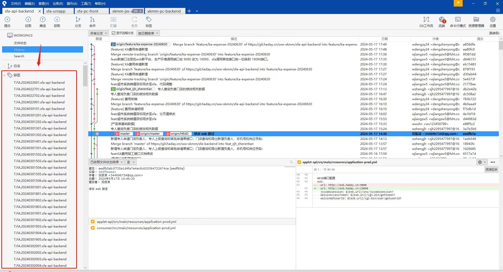
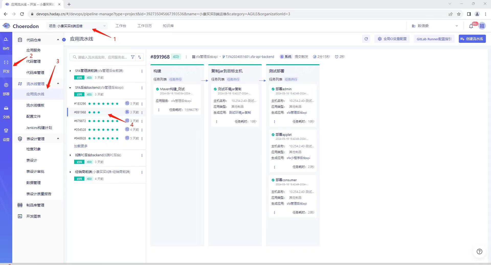

##### 1. 部署到 开发/生产 环境

公司在 “猪齿鱼” 上有搭建好的自动化部署流水线，只需要通过 git tag 标记你要部署的某个 commit ，就可以完成自动化部署。

根据 tag 不同的格式，会触发不同的流水线任务，以 SFA 后端应用为例，格式说明如下

* 开发环境：T.FA{日期}{编号}-sfa-api-backend
* 生产环境：vR.FA{日期}{编号}-sfa-api-backend

下面是 SFA 后端应用具体的 tag（管理后台的 tag 格式具体可参考 git 的提交记录，这里不再重复）。

部署时，可以在 “[猪齿鱼](https://devops.haday.cn)” （帐号应该已经为你开通好）上看到具体的流水线执行情况。
其中 SFA 后端和管理后台的流水线挂在 “[小康买买B端运维](https://devops.haday.cn/#/devops/pipeline-manage?type=project&id=392735045667393536&name=%E5%B0%8F%E5%BA%B7%E4%B9%B0%E4%B9%B0B%E7%AB%AF%E8%BF%90%E7%BB%B4&category=AGILE&organizationId=3)” 下。

##### 2. 应用的访问路径

应用的访问路径区分测试环境和生产环境，下面是两个环境的相关地址。

测试环境

* 管理后台 [http://10.254.2.40:8091](http://10.254.2.40:8091)

生产环境

* 管理后台 [https://sfa-admin.xkmm.cn](https://sfa-admin.xkmm.cn)

小程序端通过 HBuilder 启动项目，通过不同环境的配置去访问对应环境的 API 。
