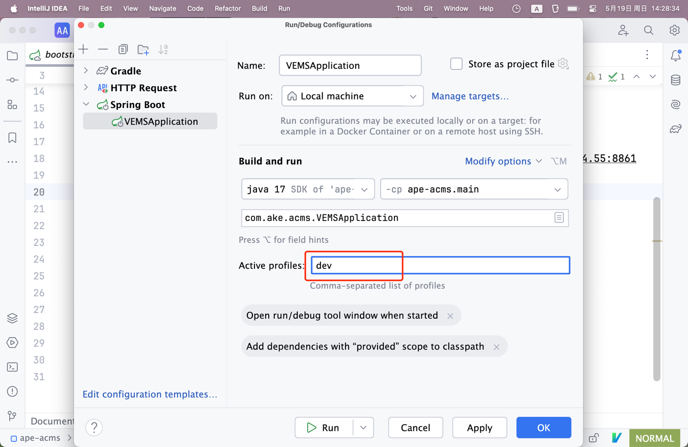

##### 1. 开发工具

通常来说，你分配的电脑可能已经预装好开发工具，或已下载好安装包（通常在文件夹 D:\开发软件xxx 中），比如 IDEA 。

##### 2. 获取项目

SFA 的项目包括 SFA 后端、管理后台前端、小程序端，三个项目，托管在公司的 gitlab 上（应该已经默认开通好了相关帐号）。这里假定你已经掌握一些 
git 的基本操作，否则请尽快学习。

三个项目地址如下：

* 后端：[https://git.haday.cn/sxw-xkmm/sfa-api-backend](https://git.haday.cn/sxw-xkmm/sfa-api-backend)
* 小程序：[https://git.haday.cn/sxw-xkmm/sfa-uniapp](https://git.haday.cn/sxw-xkmm/sfa-uniapp)
* 管理后台前端：[https://git.haday.cn/sxw-xkmm/sfa-pc-front](https://git.haday.cn/sxw-xkmm/sfa-pc-front)

##### 3. 本地调试开发（后端）

SFA 项目中已经配置好开发环境需要用到的配置，只需要在 IDEA 启动项目时，指定使用该配置文件即可。

作为后端开发，也应该掌握一些基本的前端应用部署知识，方便本地调试管理后台和小程序端相关接口，包括 npm 的基本命令，HBuilder 开发 uniapp 。
