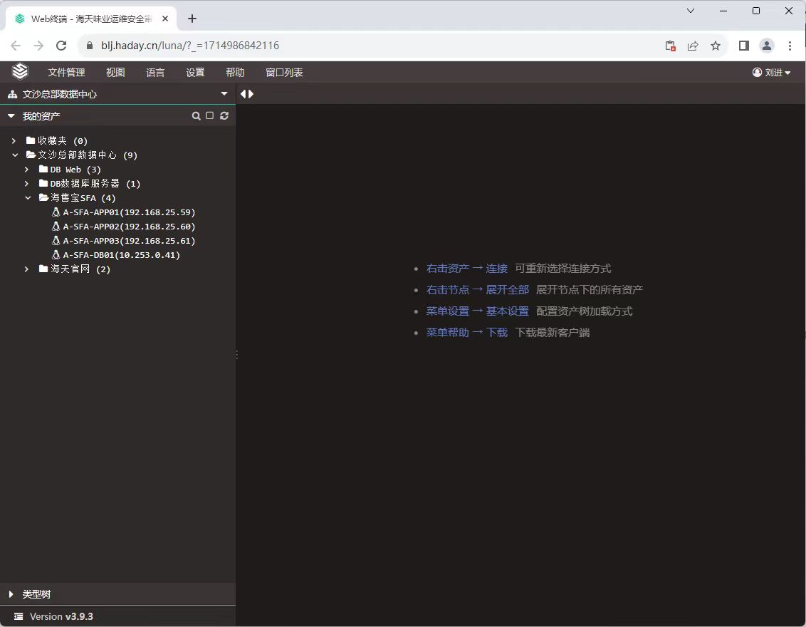
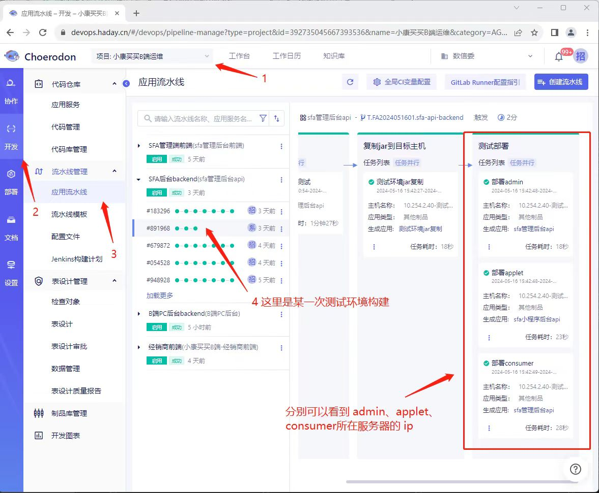

##### 日志查看

程序运行过程中，可能会产生错误，需要到服务器查看相关日志。可以通过 [堡垒机](https://blj.haday.cn/core/auth/login/) 连接到相关服务器查看应用日志（堡垒机帐号需要向刘进取得并授权）。

其中，需要访问的服务器具体 IP 可以通过流水线中找到，下面以测试环境的 SFA 后端应用为例。

找到你想要访问的应用 IP 后，就可以在堡垒机中访问对应的服务器了。
