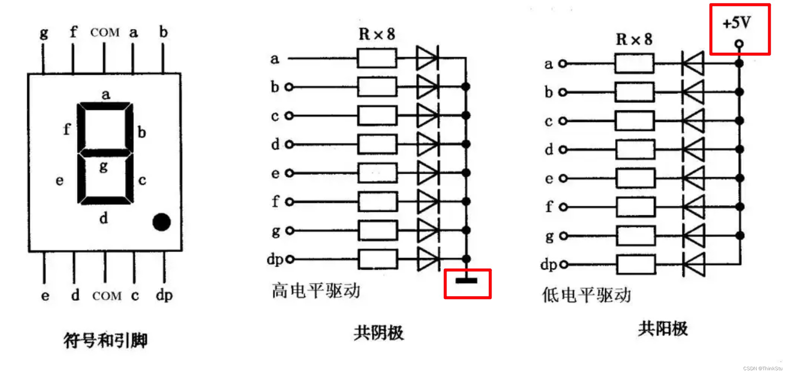
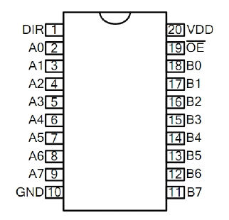

### 数码管

数码管是一种半导体发光器件， 其基本单元是发光二极管。

数码管按段数可分为七段数码管和八段数码管， 八段数码管比七段数码管多一个发光二极管单元，
也就是多一个小数点（DP），这个小数点可以更精确的表示数码管想要显示的内容。按能显示多少个（8）可分为 1 位、 2 位、 3 位、 4 位、 5 位、6 位、 7 位等数码管。
按发光二极管单元连接方式可分为共阳极数码管和共阴极数码管。

开发板中使用的是共阴极数码管。



共阴极数码管特性

* 公共阴极连接到电源地，阳极引脚连接到驱动电路的输出端，这种连接方式使得布线相对简单。 
* 需要高电平驱动，即向阳极引脚输入高电平来点亮对应的 LED 段。通常使用输出高电平有效的驱动芯片，如 74HC595 等。

### 74HC245 驱动芯片

由于单片机的 IO 口驱动能力有限（输入输出电流有限），所以开发板中使用了 74HC245 驱动芯片。



| OE | DIR | 描述 |
|-----|----------|-------------|
| L | L | Bx 输入 Ax 输出 |
| L | H | Ax 输入 Bx 属性 |
| H | X | 高阻态 |

在实验中，DIR 引脚设置为高电平，OE 引脚设置为低电平，即 Ax 输入 Bx 输出。从原理图中可以看到 Ax 接的是单片机的 P0 口，所以控制 P0 口电平就可以控制数码管各个 LED 的显示。

### 实验代码

```clike
#include "reg52.h"

typedef unsigned int u16; // 对系统默认数据类型进行重定义
typedef unsigned char u8;

#define SMG_A_DP_PORT P0 // 使用宏定义数码管段码口

// a  接 P0.0
// b  接 P0.1
// c  接 P0.2
// d  接 P0.3
// e  接 P0.4
// f  接 P0.5
// g  接 P0.6
// dp 接 P0.7

// 共阴极数码管显示 0 ~ F 的段码数据
u8 gsmg_code[17] = {
    0x3f,  // 0b00111111  0
    0x06,  // 0b00000110  1
    0x5b,  // 0b01011011  2
    0x4f,  // 0b01001111  3
    0x66,  // 0b01100110  4
    0x6d,  // 0b01101101  5
    0x7d,  // 0b01111101  6
    0x07,  // 0b00000111  7
    0x7f,  // 0b01111111  8
    0x6f,  // 0b01101111  9
    0x77,  // 0b01110111  A
    0x7c,  // 0b01111100  B
    0x39,  // 0b00111001  C
    0x5e,  // 0b01011110  D
    0x79,  // 0b01111001  E
    0x71   // 0b01110001  F
};

void main()
{
    SMG_A_DP_PORT = gsmg_code[0]; //将数组第 1 个数据赋值给数码管段选口

    while(1)
    {

    }
}
```

前面学习的点亮 LED ，我们单独给 IO (Input/Output)口的一个位赋值 P2^5 ，其实每组 IO 口都由一个 8 位的寄存器控制，上面的实验中，我们使用的是 P0 口，所以直接给 P0 赋值。在 C 语言中，二进制数以 0b 开头表示，如 0b00000001 表示十进制的 1，0b10000000 表示十进制的 128。我们可以通过二进制数来更直观地控制 8 位寄存器中的每一位。

代码中，使用宏定义将 P0 口定义为 `SMG_A_DP_PORT`，这样在后续的代码中就可以直接使用 `SMG_A_DP_PORT` 来操作 P0 口。

宏定义是一种预处理指令，在编译前会进行文本替换，使用 `#define` 关键字定义。当编译器遇到 `SMG_A_DP_PORT` 时，会自动将其替换为 `P0`。这种方式不仅可以提高代码的可读性，还可以方便后续修改 - 如果需要更换端口，只需要修改宏定义处的 P0 即可，而不用修改所有用到该端口的代码。
