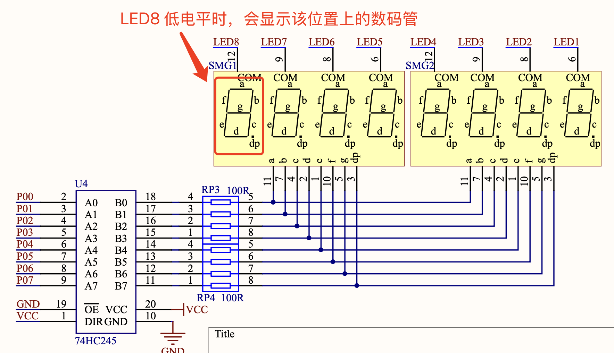
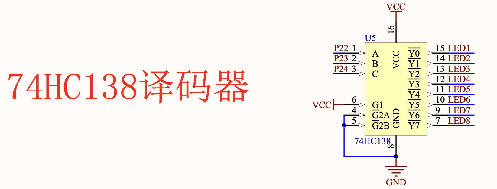

### 动态数码管

上一节，我们让数码管的第一位显示出了各种数字，这一节我们让剩下的 7 位数码管也显示出各种数字，最终可以实现显示出一个多位数。

从原理图中可以看到，上一节没有介绍到的数码管上的`位选`引脚。位选引脚的作用是：当位选信号为低电平时，对应的数码管才会显示。



实现数码管的动态显示，思路是轮流点亮不同位上的数码管，通过快速切换不同位上的数码管，让用户感觉多个数码管同时显示。

### 138 译码器



138 译码器是一种组合逻辑电路，它可以将 3 位二进制数转换为 8 位二进制数。

138 译码器的真值表如下：

| A2 / C | A1 / B | A0 / A | Y7 / LED8 | Y6 / LED7 | Y5 / LED6 | Y4 / LED5 | Y3 / LED4 | Y2 / LED3 | Y1 / LED2 | Y0 / LED1 |
|----|----|----|----|----|----|----|----|----|----|----| 
| 0  | 0  | 0  | 1  | 1  | 1  | 1  | 1  | 1  | 1  | 0  |
| 0  | 0  | 1  | 1  | 1  | 1  | 1  | 1  | 1  | 0  | 1  |
| 0  | 1  | 0  | 1  | 1  | 1  | 1  | 1  | 0  | 1  | 1  |
| 0  | 1  | 1  | 1  | 1  | 1  | 1  | 0  | 1  | 1  | 1  |
| 1  | 0  | 0  | 1  | 1  | 1  | 0  | 1  | 1  | 1  | 1  |
| 1  | 0  | 1  | 1  | 1  | 0  | 1  | 1  | 1  | 1  | 1  |
| 1  | 1  | 0  | 1  | 0  | 1  | 1  | 1  | 1  | 1  | 1  |
| 1  | 1  | 1  | 0  | 1  | 1  | 1  | 1  | 1  | 1  | 1  |

使用 138 译码器，只需要占用 3 个单片机上的 IO 口，就可以实现某一时刻只点亮一个数码管。

从真值表中可以看出，因为单片机引脚默认情况下是高电平，所以上一节中，是 LED8 所在的数码管被点亮了。

### 实验代码

```clike
#include "reg52.h"

typedef unsigned int u16;
typedef unsigned char u8;

#define SMG_A_DP_PORT P0 // 使用宏定义数码管段码口

//定义数码管位选信号控制脚
sbit LSA=P2^2;
sbit LSB=P2^3;
sbit LSC=P2^4;

// 共阴极数码管显示 0 ~ F 的段码数据
u8 gsmg_code[17] = {
  0x3f,  // 0b00111111  0
  0x06,  // 0b00000110  1
  0x5b,  // 0b01011011  2
  0x4f,  // 0b01001111  3
  0x66,  // 0b01100110  4
  0x6d,  // 0b01101101  5
  0x7d,  // 0b01111101  6
  0x07,  // 0b00000111  7
  0x7f,  // 0b01111111  8
  0x6f,  // 0b01101111  9
  0x77,  // 0b01110111  A
  0x7c,  // 0b01111100  B
  0x39,  // 0b00111001  C
  0x5e,  // 0b01011110  D
  0x79,  // 0b01111001  E
  0x71   // 0b01110001  F
};

void delay_10us(u16 ten_us) {
  while (ten_us--);
}

void smg_display(void) {
  u8 i=0;

  for(i=0;i<8;i++) {
    switch(i) // 位选
    {
      case 0: 
        LSC = 1;
        LSB = 1;
        LSA = 1;
        break;
      case 1: 
        LSC = 1;
        LSB = 1;
        LSA = 0;
        break;
      case 2: 
        LSC = 1;
        LSB = 0;
        LSA = 1;
        break;
      case 3: 
        LSC = 1;
        LSB = 0;
        LSA = 0;
        break;
      case 4: 
        LSC = 0;
        LSB = 1;
        LSA = 1;
        break;
      case 5: 
        LSC = 0;
        LSB = 1;
        LSA = 0;
        break;
      case 6: 
        LSC = 0;
        LSB = 0;
        LSA = 1;
        break;
      case 7: 
        LSC = 0;
        LSB = 0;
        LSA = 0;
        break;
    }
    SMG_A_DP_PORT = gsmg_code[i]; // 传送段选数据
    delay_10us(100); // 延时一段时间，等待显示稳定
    SMG_A_DP_PORT = 0x00;
  }
}

void main() {
  while(1) {
    smg_display();
  }
}
```