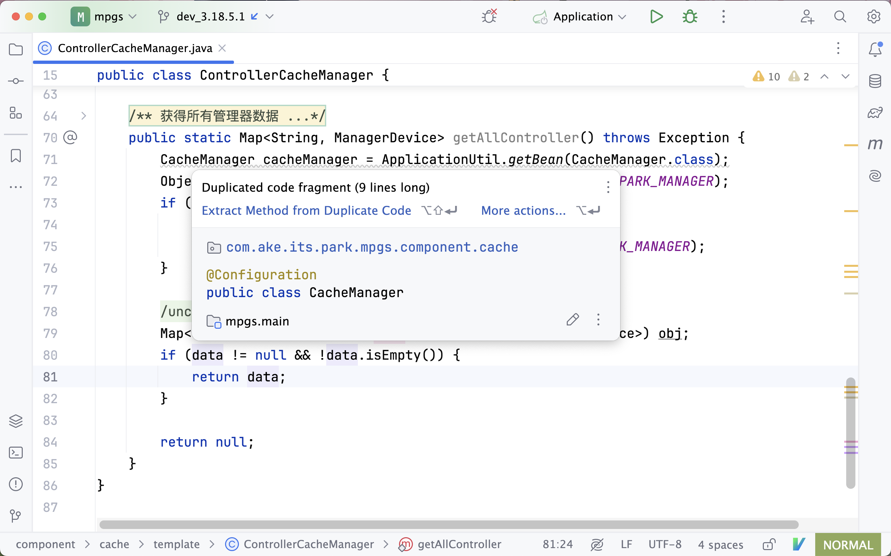
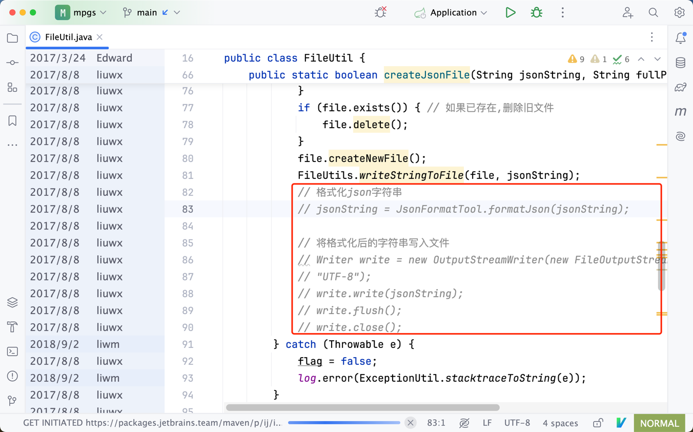

不是只有你的穿着外表代表着你的形象，还有你写的代码。写每行一代码时考虑别人的阅读感受。

> 程序写出来是给人看的，附带能在机器上运行。《计算机程序的构造和解释》

> “如果你是个木匠，你要做一个漂亮的衣柜，你不会用胶合板做背板，虽然这一块是靠着墙的，没人会看见。你自己知道它就在那儿，所以你会用一块漂亮的木头去做背板。如果你想晚上睡得安稳的话，就要保证外观和质量都足够好。”《乔布斯传》

##### 1. 注重代码的格式化

注重代码的格式化，最简单的来说就是，该加空格的地方加空格，该换行的地方换行。 具体格式化的规则，如果团队中没有特殊要求，保持 IDE 默认设置即可，不必重复发明轮子，也不需死记硬背。

下面是一个简短的例子。

```java
// 没有格式化，拥挤的代码
if(condition){
    ... 
}

// 有合适空格的代码
if (condition) {
    ...
}
```

请经常使用这个快捷键 `Ctrl + Alt + L` ，让机器为你自动完成这些。

##### 2. DRY 原则（Don't repeat yourself）

不要重复自己，提倡代码重用。

如果多次遇到同样的问题，就应该抽象出一个共同的解决方法，不要重复开发同样的功能。否则，将来需要修改这个功能的时候，你需要修改多处，也可能会有遗漏。

多关注 IDE 给你提示的这些下划线（即使这些代码很可能不是我们自己写的，请让它变好）。



##### 3. 写好注释

不要迷信代码即文档，因为每个开发人员水平不一（巧的是，可能每个开发人员都会觉得，自己写的代码才是最好的，最简单易读的），写好注释交代好正在实现
的功能（尤其是业务代码），可以给将来阅读这份代码的人带来很多的方便 （也可能是你自己），减轻很多心智负担。大家都很忙，就不要让别人猜测你的意图了。

过分愚蠢的注释也不可取，下面是一个真实例子。

```java
public static byte[] readInputStream(InputStream inStream) {  
   byte []ret = null;
   ByteArrayOutputStream outStream = null;
   try {
        outStream = new ByteArrayOutputStream();  
        //创建一个Buffer字符串  
        byte[] buffer = new byte[1024];  
        //每次读取的字符串长度，如果为-1，代表全部读取完毕  
        int len = 0;  
        //使用一个输入流从buffer里把数据读取出来  
        while( (len=inStream.read(buffer)) != -1 ){  
            //用输出流往buffer里写入数据，中间参数代表从哪个位置开始读，len代表读取的长度  
            outStream.write(buffer, 0, len);  
        }  
        
        if(inStream!=null){
            //关闭输入流  
            inStream.close();  
        }
        //把outStream里的数据写入内存  
        
        ret  = outStream.toByteArray();
        
        if(outStream!=null){
            outStream.close();
        }
    } catch (Exception e) {
        logger.error(ExceptionUtil.stacktraceToString(e));
    }finally {
        if(outStream!=null){

            IoUtil.close(outStream);
            
            if(inStream!=null){

                IoUtil.close(inStream);
            }
        }
    }

    return ret; 
}
```

##### 4. 注释是用来解释实现的

注释是用来解释实现的，不是用来 “屏蔽” 代码，确定不再使用的代码，请及时清理掉，不要在项目中遗留 “垃圾” ，你自己都不用的代码，还指望谁会来使用？
如果觉得将来有可能重新使用这些代码，也放心清理，因为 git 会记录这些变更（是的，是谁写的烂代码，git 都会记住）。



##### 5. 及时保存你的工作成果

按照实现的功能，切分好每次代码提交并通过 Commit Message 描述好提交的内容。

##### 6. 不要过度封装

有的开发人员，喜欢为一些引入的第三方库按照自己习惯的风格或喜好进行过度封装。

事实上，我们引入的库基本上都会有相关的文档说明，当我们对某个 API 用法有疑惑时，
我们通过阅读官方文档找到答案，如果是自己封装的代码，往往会缺少相关文档，导致维护这份代码的其他同事，使用某些代码时不得不去阅读里面的具体实现，降低效率。

##### 7. 尊重社区习惯少说互联网黑话

比如在 Java 开发中，我们习惯用 `interface` 或 `接口` 来描述某些抽象方法。而其他社区，比如在 PHP（Laravel），则习惯用 `facade` 或 `门面`，
其实都是在描述同样的事物，没必要混用来彰显与别不同，因为其他开发人员不一定也接触过你所了解的，减少给他人带来困扰。

##### 8. 关注代码行数 keep it simple

保持对代码行数这一数字的敏感，尽可保持代码简洁有效（前提是要保证可读性）。比如一个过千行代码的小程序页面，基本上可以怀疑这里面有大量重复或无用的代码。
