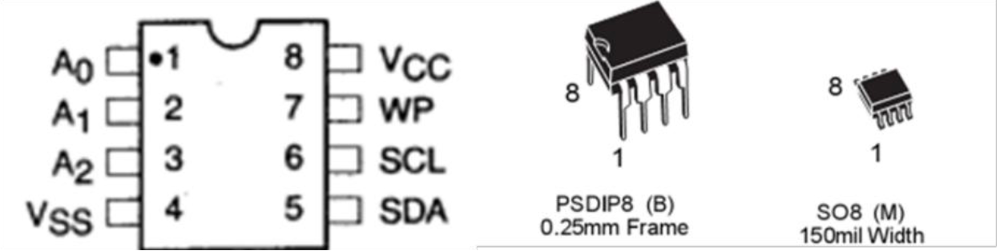
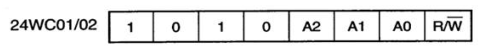

### I2C EEPROM

这一节我们来学习如何使用 51 单片机的 IO 口模拟 I2C 时序，并实现与 AT24C02（EEPROM）之间的双向通信。

I2C 视频介绍: https://www.bilibili.com/video/BV1RzxJeMEdy/?spm_id_from=333.1007.top_right_bar_window_history.content.click

### AT24C02 简单介绍

我们前面学习的所有程序都有一个特点，程序运行过程的数据在掉电后都会丢失，每次重新上电后，只能回到初始状态，数据缺乏 `持久化` 的保存。试想一下，如果你的电脑不能保存数据，每次重启后，
之前的工作成果都会丢失，那会是多么的糟糕。

就像平时使用电脑一样，我们可以把各种数据，通过文件的形式，保存到硬盘中，即时关机重启，我们仍然能够看到之前保存的数据，在单片机系统中，虽然一般很少会有这样直接的保存文件操作，但我们也可以借助像 AT24C02 这样的硬件模块，来实现简单的数据保存。这样，我们就可以把程序运行过程中产生的一些数据保存起来，即使单片机系统掉电关机，下次重启后，依然能够读取到之前保存起来的数据。

AT24C02 芯片示意图



从上面的视频看到，操作一个 iic 通信设备时，需要先找到需要的通信设备（可能会有多个设备），所以需要通过下面的方式设置 AT24C02 的"地址"。

AT24C02 器件地址为 7 位，高 4 位固定为 1010，低 3 位由 A0/A1/A2 信号线的电平决定。 因为传输地址或数据是以字节为单位传送的， 当传送地址时，
器件地址占 7 位，还有最后一位（最低位 R/W）用来选择读写方向，它与地址无关。其格式如下：



我们开发板已经将芯片的 A0/A1/A2 连接到 GND，所以器件地址为 1010000， 即 0x50 （未计算最低位） 。 如果要对芯片进行写操作时， R/W 即为 0，
写器件地址即为 0XA0；如果要对芯片进行读操作时，R/W 即为 1，此时读器件地址为 0XA1。 开发板上也将 WP 引脚直接接在 GND 上， 此时芯片允许数据正常读写。

### 实验代码

按照 iic 通信协议，以及 AT24C02 操作手册，实现数据的写入与读出。

```clike
#include "reg52.h"

// 对系统默认数据类型进行重定义
typedef unsigned int u16;
typedef unsigned char u8;

#define EEPROM_ADDRESS    0    // 定义数据存入EEPROM的起始地址

// 定义EEPROM控制脚
sbit IIC_SCL = P2^1;    // SCL时钟线
sbit IIC_SDA = P2^0;    // SDA数据线


// 延时函数：10us级延时
void delay_10us(u16 ten_us)
{
    while(ten_us--);    
}

// 延时函数：ms级延时
void delay_ms(u16 ms)
{
    u16 i, j;
    for(i = ms; i > 0; i--)
        for(j = 110; j > 0; j--);
}


/*******************************************************************************
* 函 数 名       : iic_start
* 函数功能		 : 产生IIC起始信号
* 输    入       : 无
* 输    出    	 : 无
*******************************************************************************/
void iic_start(void)
{
    IIC_SDA = 1;    // 如果把该条语句放在SCL后面，第二次读写会出现问题
    delay_10us(1);
    IIC_SCL = 1;
    delay_10us(1);
    IIC_SDA = 0;    // 当SCL为高电平时，SDA由高变为低
    delay_10us(1);
    IIC_SCL = 0;    // 钳住I2C总线，准备发送或接收数据
    delay_10us(1);
}

/*******************************************************************************
* 函 数 名         : iic_stop
* 函数功能		   : 产生IIC停止信号   
* 输    入         : 无
* 输    出         : 无
*******************************************************************************/
void iic_stop(void)
{    
    IIC_SDA = 0;    // 如果把该条语句放在SCL后面，第二次读写会出现问题
    delay_10us(1);
    IIC_SCL = 1;
    delay_10us(1);
    IIC_SDA = 1;    // 当SCL为高电平时，SDA由低变为高
    delay_10us(1);            
}

/*******************************************************************************
* 函 数 名         : iic_ack
* 函数功能		   : 产生ACK应答  
* 输    入         : 无
* 输    出         : 无
*******************************************************************************/
void iic_ack(void)
{
    IIC_SCL = 0;
    IIC_SDA = 0;    // SDA为低电平
    delay_10us(1);
    IIC_SCL = 1;
    delay_10us(1);
    IIC_SCL = 0;
}

/*******************************************************************************
* 函 数 名         : iic_nack
* 函数功能		   : 产生NACK非应答  
* 输    入         : 无
* 输    出         : 无
*******************************************************************************/
void iic_nack(void)
{
    IIC_SCL = 0;
    IIC_SDA = 1;    // SDA为高电平
    delay_10us(1);
    IIC_SCL = 1;
    delay_10us(1);
    IIC_SCL = 0;    
}

/*******************************************************************************
* 函 数 名         : iic_wait_ack
* 函数功能		   : 等待应答信号到来   
* 输    入         : 无
* 输    出         : 1-接收应答失败；0-接收应答成功
*******************************************************************************/
u8 iic_wait_ack(void)
{
    u8 time_temp = 0;
    
    IIC_SCL = 1;
    delay_10us(1);
    while(IIC_SDA)    // 等待SDA为低电平
    {
        time_temp++;
        if(time_temp > 100)    // 超时则强制结束IIC通信
        {    
            iic_stop();
            return 1;    
        }            
    }
    IIC_SCL = 0;
    return 0;    
}

/*******************************************************************************
* 函 数 名         : iic_write_byte
* 函数功能		   : IIC发送一个字节 
* 输    入         : dat-发送的字节数据
* 输    出         : 无
*******************************************************************************/
void iic_write_byte(u8 dat)
{                        
    u8 i = 0; 
	    
    IIC_SCL = 0;
    for(i = 0; i < 8; i++)    // 循环8次发送一个字节（先传高位）
    {              
        if((dat & 0x80) > 0) 
            IIC_SDA = 1;
        else
            IIC_SDA = 0;
            
        dat <<= 1; 	  
        delay_10us(1);  
        IIC_SCL = 1;
        delay_10us(1); 
        IIC_SCL = 0;	
        delay_10us(1);
    }	 
}

/*******************************************************************************
* 函 数 名         : iic_read_byte
* 函数功能		   : IIC读一个字节 
* 输    入         : ack=1时发送ACK，ack=0时发送NACK
* 输    出         : 读取到的字节数据
*******************************************************************************/
u8 iic_read_byte(u8 ack)
{
    u8 i = 0, receive = 0;
   	
    for(i = 0; i < 8; i++)    // 循环8次读取一个字节（先读高位）
    {
        IIC_SCL = 0; 
        delay_10us(1);
        IIC_SCL = 1;
        receive <<= 1;
        if(IIC_SDA)
            receive++;   
        delay_10us(1); 
    }					 
    
    if (!ack)
        iic_nack();
    else
        iic_ack();  
		  
    return receive;
}

/*******************************************************************************
* 函 数 名         : at24c02_write_one_byte
* 函数功能		   : 在AT24CXX指定地址写入一个数据
* 输    入         : addr-写入数据的目的地址；dat-要写入的数据
* 输    出         : 无
*******************************************************************************/
void at24c02_write_one_byte(u8 addr, u8 dat)
{				   	  	    																 
    iic_start();  
    iic_write_byte(0XA0);    // 发送写命令	    	  
    iic_wait_ack();	   
    iic_write_byte(addr);    // 发送写地址   
    iic_wait_ack(); 	 										  		   
    iic_write_byte(dat);    // 发送字节    							   
    iic_wait_ack();  		    	   
    iic_stop();    // 产生停止条件
    delay_ms(10);	 
}

/*******************************************************************************
* 函 数 名         : at24c02_read_one_byte
* 函数功能		   : 在AT24CXX指定地址读出一个数据
* 输    入         : addr-开始读数的地址 
* 输    出         : 读到的数据
*******************************************************************************/
u8 at24c02_read_one_byte(u8 addr)
{				  
    u8 temp = 0;		  	    																 
    iic_start();  
    iic_write_byte(0XA0);    // 发送写命令	   
    iic_wait_ack(); 
    iic_write_byte(addr);  // 发送读取地址  
    iic_wait_ack();	    
    iic_start();  	 	   
    iic_write_byte(0XA1);  // 进入接收模式         			   
    iic_wait_ack();	 
    temp = iic_read_byte(0);    // 读取字节		   
    iic_stop();    // 产生停止条件    
    return temp;    // 返回读取的数据
}


// 定义独立按键控制脚
sbit KEY1 = P3^1;
sbit KEY2 = P3^0;
sbit KEY3 = P3^2;
sbit KEY4 = P3^3;

// 独立按键按下的键值宏定义
#define KEY1_PRESS    1
#define KEY2_PRESS    2
#define KEY3_PRESS    3
#define KEY4_PRESS    4
#define KEY_UNPRESS   0

// 按键扫描函数
u8 key_scan(u8 mode)
{
    static u8 key = 1;

    if(mode)
        key = 1;    // 连续扫描模式
    
    // 任意按键按下
    if(key == 1 && (KEY1 == 0 || KEY2 == 0 || KEY3 == 0 || KEY4 == 0))
    {
        delay_10us(1000);    // 消抖
        key = 0;
        
        if(KEY1 == 0)
            return KEY1_PRESS;
        else if(KEY2 == 0)
            return KEY2_PRESS;
        else if(KEY3 == 0)
            return KEY3_PRESS;
        else if(KEY4 == 0)
            return KEY4_PRESS;	
    }
    // 无按键按下
    else if(KEY1 == 1 && KEY2 == 1 && KEY3 == 1 && KEY4 == 1)	
    {
        key = 1;			
    }
    
    return KEY_UNPRESS;		
}


#define SMG_A_DP_PORT    P0    // 数码管段码口宏定义

// 定义数码管位选信号控制脚
sbit LSA = P2^2;
sbit LSB = P2^3;
sbit LSC = P2^4;

// 共阴极数码管显示0~F的段码数据
u8 gsmg_code[17] = {0x3f, 0x06, 0x5b, 0x4f, 0x66, 0x6d, 0x7d, 0x07,
                    0x7f, 0x6f, 0x77, 0x7c, 0x39, 0x5e, 0x79, 0x71};

/*******************************************************************************
* 函 数 名       : smg_display
* 函数功能		 : 动态数码管显示
* 输    入       : dat-要显示的数据数组；pos-从左开始显示的位置（1-8）
* 输    出    	 : 无
*******************************************************************************/
void smg_display(u8 dat[], u8 pos)
{
    u8 i = 0;
    u8 pos_temp = pos - 1;

    for(i = pos_temp; i < 8; i++)
    {
        // 位选信号控制
        switch(i)
        {
            case 0: LSC=1; LSB=1; LSA=1; break;
            case 1: LSC=1; LSB=1; LSA=0; break;
            case 2: LSC=1; LSB=0; LSA=1; break;
            case 3: LSC=1; LSB=0; LSA=0; break;
            case 4: LSC=0; LSB=1; LSA=1; break;
            case 5: LSC=0; LSB=1; LSA=0; break;
            case 6: LSC=0; LSB=0; LSA=1; break;
            case 7: LSC=0; LSB=0; LSA=0; break;
        }
        
        SMG_A_DP_PORT = gsmg_code[dat[i - pos_temp]];    // 传送段选数据
        delay_10us(100);    // 延时等待显示稳定
        SMG_A_DP_PORT = 0x00;    // 消隐
    }
}


// 主函数
void main()
{	
    u8 key_temp = 0;
    u8 save_value = 0;
    u8 save_buf[3];

    while(1)
    {			
        key_temp = key_scan(0);    // 按键扫描（单次触发模式）
        
        // 根据按键执行对应操作
        if(key_temp == KEY1_PRESS)
        {
            at24c02_write_one_byte(EEPROM_ADDRESS, save_value);    // 写入EEPROM
        }
        else if(key_temp == KEY2_PRESS)
        {
            save_value = at24c02_read_one_byte(EEPROM_ADDRESS);    // 从EEPROM读取
        }
        else if(key_temp == KEY3_PRESS)
        {
            save_value++;    // 数值递增
            if(save_value == 255)
                save_value = 255;    // 上限限制
        }
        else if(key_temp == KEY4_PRESS)
        {
            save_value = 0;    // 数值清零
        }
        
        // 拆分数值为百位、十位、个位
        save_buf[0] = save_value / 100;
        save_buf[1] = save_value % 100 / 10;
        save_buf[2] = save_value % 100 % 10;
        
        // 在数码管第6位开始显示
        smg_display(save_buf, 6);
    }		
}
```
