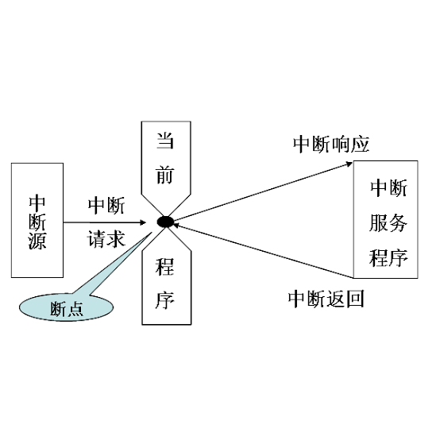
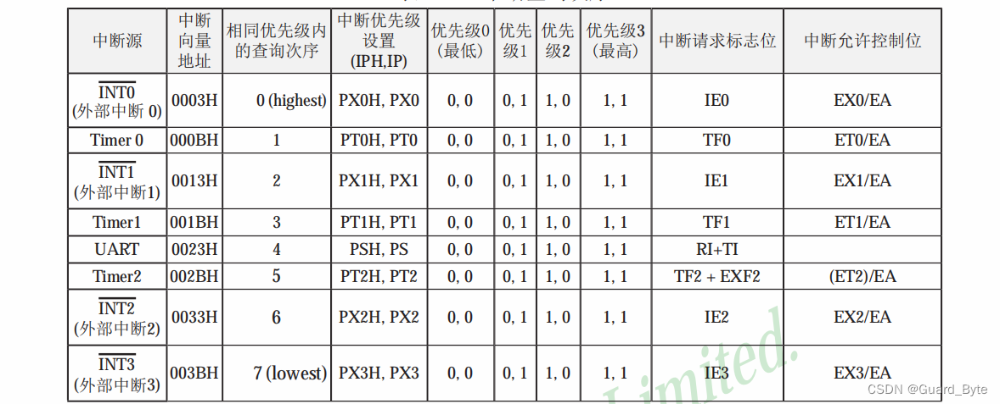

### 中断系统

什么是中断？举一个生活中的例子：你打开火，烧上一壶水。然后去洗衣服，在洗衣服的过程中，突然听到水壶发出水开的报警声，这时，你停止洗衣服动作，
立即去关掉火，然后将开水灌入暖水瓶中，灌完开水后，你又回去继续洗衣服。这个过程中实际上就发生了一次中断。

计算机操作系统之所以能够"同时"运行进程，与中断也密切相关。



### 51 单片机的中断寄存器

STC89C5X 系列单片机提供了 8 个中断请求源，它们分别是：外部中断 0 (INT0)、 外部中断 1 (INT1)、 外部中断 2 (INT2)、 外部中断 3 (INT3)、 定时器 0 中断、
定时器 1 中断、定时器 2 中断、串口(UART)中断。

比如下图中，要开启 `外部中断 0` 需要使能 `EX0 = 1` 、 `EA = 1`



接下来准备做的外部中断 0 实验有以下注意事项。 INT0 对应的是 P3.2 口的附加功能，可由 IT0(TCON.0)选择其为低电平有效还是下降沿有效。
当 CPU 检测到 P3.2 引脚上出现有效的中断信号时，中断标志 IE0(TCON.1)置 1，向 CPU 申请中断。

### 外部中断 1 实验

```clike
#include "reg52.h"

typedef unsigned int u16;
typedef unsigned char u8;

sbit LED1 = P2^0;

sbit KEY3 = P3^2;

void delay_10us(u16 ten_us)
{
	while (ten_us--);	
}

void exti0_init(void)
{
	IT0 = 1; // 跳变沿触发方式（下降沿）
	EX0 = 1; // 打开 INT0 的中断允许
	EA = 1;  // 打开总中断
}

void main()
{	
	exti0_init(); // 外部中断0配置

	while (1)
	{			
							
	}		
}

// 外部中断0中断函数
void exti0() interrupt 0 
{
	delay_10us(1000);  // 消抖
	if (KEY3 == 0)     // 再次判断K3键是否按下
		LED1 = !LED1;  // LED1 状态翻转					
}
```
