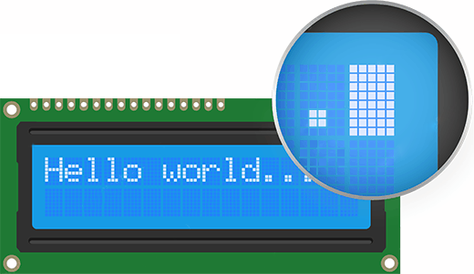

### LCD1602

#### 1602简介

1602 液晶也叫 1602 字符型液晶，它能显示 2 行字符信息，每行又能显示 16 个字符。它是一种专门用来显示字母、数字、符号的点阵型液晶模块。它是由若干个 
5x7 或者 5x10 的点阵字符位组成，每个点阵字符位都可以用显示一个字符，每位之间有一个点距的间隔，每行之间也有间隔，起到了字符间距和行间距的作用，
正因为如此，所以它不能很好的显示图片。

实物图片



视频介绍 https://www.bilibili.com/video/BV1tG4y1L7Um/?spm_id_from=333.337.search-card.all.click

#### 引脚功能

LCD1602 采用标准的 14 脚（无背光）或 16 脚（带背光）接口，各引脚接口说明见表。

编号 | 符号 | 引脚说明
-|:-:|-:
1 | VSS | 电源地
2 | VDD | 电源正极
3 | VL | 液晶显示偏压
4 | RS | 数据/命令选择
5 | R/W | 读/写选择
6 | E | 使能信号
7 | D0 | 数据
8 | D1 | 数据
9 | D2 | 数据
10 | D3 | 数据
11 | D4 | 数据
12 | D5 | 数据
12 | D5 | 数据
13 | D6 | 数据
14 | D7 | 数据
15 | BLA | 背光源正极
16 | BLK | 背光源负极

#### LCD1602 使用

要使用 LCD1602，首先需要对其初始化，即通过写入一些特定的指令实现。然后选择要在 LCD1602 的哪个位置显示并将所要显示的数据发送到 LCD 的
DDRAM。使用 LCD1602 通常都是用于写数据进去，很少使用读功能。LCD1602 操作步骤如下:

1. 初始化
2. 写命令（RS=L），设置显示坐标
3. 写数据（RS=H）

① 当要写指令字，设置 LCD1602 的工作方式时：需要把 RS 置为低电平，RW 置为低电平，然后将数据送到数据口 D0~D7， 最后 E 引脚一个高脉冲将数据写入。

② 当要写入数据字， 在 1602 上实现显示时： 需要把 RS 置为高电平， RW 置为低电平，然后将数据送到数据口 D0~D7，最后 E 引脚一个高脉冲将数据写入。

#### 实验代码

```clike
#include "reg52.h"

#define LCD1602_DATAPORT P0    // 宏定义LCD1602数据端口

// 对系统默认数据类型进行重定义
typedef unsigned int  u16;
typedef unsigned char u8;
typedef unsigned long u32;

// 管脚定义
sbit LCD1602_RS = P2^6;  // 数据命令选择
sbit LCD1602_RW = P2^5;  // 读写选择
sbit LCD1602_E  = P2^7;  // 使能信号

/*
 * @param ms 延时时长(毫秒)
 */
void delay_ms(u16 ms)
{
    u16 i, j;
    for(i = ms; i > 0; i--)
        for(j = 110; j > 0; j--);
}

/**
 * 向LCD1602写入命令
 * @param cmd 要写入的命令
 */
void lcd1602_write_cmd(u8 cmd)
{
    LCD1602_RS = 0;               // 选择命令
    LCD1602_RW = 0;               // 选择写
    LCD1602_E  = 0;
    LCD1602_DATAPORT = cmd;       // 准备命令
    delay_ms(1);
    LCD1602_E  = 1;               // 使能脚E上升沿写入
    delay_ms(1);
    LCD1602_E  = 0;               // 使能脚E负跳变完成写入
}

/**
 * 向LCD1602写入数据
 * @param dat 要写入的数据
 */
void lcd1602_write_data(u8 dat)
{
    LCD1602_RS = 1;               // 选择数据
    LCD1602_RW = 0;               // 选择写
    LCD1602_E  = 0;
    LCD1602_DATAPORT = dat;       // 准备数据
    delay_ms(1);
    LCD1602_E  = 1;               // 使能脚E上升沿写入
    delay_ms(1);
    LCD1602_E  = 0;               // 使能脚E负跳变完成写入
}

/**
 * 初始化LCD1602显示屏
 */
void lcd1602_init(void)
{
    lcd1602_write_cmd(0x38);  // 数据总线8位，显示2行，5*7点阵/字符
    lcd1602_write_cmd(0x0c);  // 显示功能开，无光标，光标不闪烁
    lcd1602_write_cmd(0x06);  // 写入新数据后光标右移，显示屏不移动
    lcd1602_write_cmd(0x01);  // 清屏
}

/**
 * 清除LCD1602显示内容
 */
void lcd1602_clear(void)
{
    lcd1602_write_cmd(0x01);  // 清屏命令
}

/**
 * @param x 列坐标(0-15)
 * @param y 行坐标(0-1)
 * @param str 要显示的字符串
 */
void lcd1602_show_string(u8 x, u8 y, u8 *str)
{
    u8 i = 0;

    if(y > 1 || x > 15)  // 行列参数不对则强制退出
        return;

    if(y < 1)  // 第1行显示
    {
        while(*str != '\0')  // 字符串以'\0'结尾，循环显示所有字符
        {
            if(i < 16 - x)  // 字符长度未超过第一行显示范围
            {
                lcd1602_write_cmd(0x80 + i + x);  // 第一行显示地址设置
            }
            else  // 字符长度超过第一行，在第二行继续显示
            {
                lcd1602_write_cmd(0x80 + 0x40 + i + x - 16);  // 第二行显示地址设置
            }
            lcd1602_write_data(*str);  // 显示当前字符
            str++;  // 指针递增，指向 next character
            i++;
        }
    }
    else  // 第2行显示
    {
        while(*str != '\0')
        {
            if(i < 16 - x)  // 字符长度未超过第二行显示范围
            {
                lcd1602_write_cmd(0x80 + 0x40 + i + x);
            }
            else  // 字符长度超过第二行，在第一行继续显示
            {
                lcd1602_write_cmd(0x80 + i + x - 16);
            }
            lcd1602_write_data(*str);
            str++;
            i++;
        }
    }
}

void main()
{
    lcd1602_init();                  // LCD1602初始化
    lcd1602_show_string(0, 0, "Hello World!");  // 第一行显示
    lcd1602_show_string(0, 1, "0123456789");    // 第二行显示
    
    while(1)
    {
        // 主循环空操作
    }
}

```

#### C 语言指针

上面的代码中 lcd1602_show_string 函数出现了 `u8 *str` 这样的参数，这种数据类型在 C 语言中称为 **指针** ，指针是 C 语言最重要的概念之一。

##### 值传递和指针传递

```clike
#include <stdio.h>

void add1(int a) {
    a = a + 1;
}

int main() {
    int a = 2;

    add1(a);

    printf("调用 add1 后 a = %d\n", a);
}
```

运行上面的代码，我们可以看到，在 add1 函数调用后，a 的值，依然是 2，这是因为在调用 add1 函数的时候， add1 函数中的 a 变量，是一个 "新的" "临时的" 变量，只是这个变量里面的值 **等于** main 函数中的 a 变量的值，
它们是两个不同的变量(意思是它们在内存中，占据着不同的位置)。所以，在函数 add1 调用结束后，main 函数中的 a 依然是 2，我们把这种情况称为 "值传递"。

```clike
#include <stdio.h>

void add1(int* a) {
    *a = *a + 1;
}

int main() {
    int a = 2;

    add1(&a);

    printf("调用 add1 后 a = %d\n", a);
}
```

上面这段代码，在 add1 调用后，main 函数中的 a 变成了 3，很明显 add1 函数修改了 a 中保存的值。这是因为在调用 add1 函数时，我们传递给 add1 的是 a 变量的地址 `&a`，即 a 变量在内存中的位置，所以，
如果在 add1 函数中直接将新的值写入到这个内存地址时，main 函数中的那个 a 变量就会被修改了，这种传参方式称为"指针传递"。
