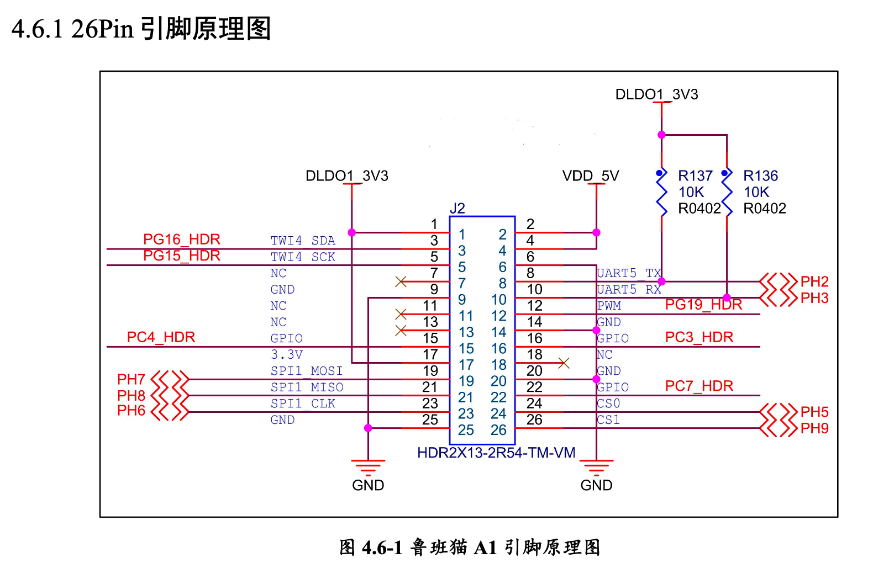
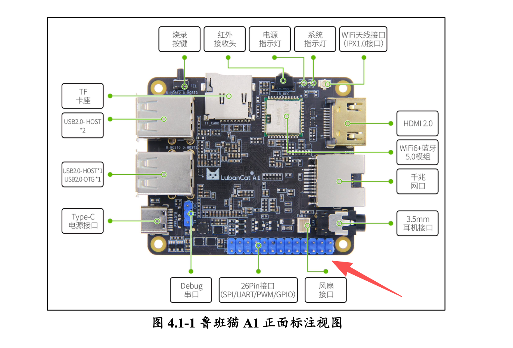

#### GPIO

##### 26 PIN GPIO

与单纯的在 Linux 服务器上开发应用程序不同，在开发板中开发的应用程序，可以利用 GPIO 引脚对接各种不同的外设：按钮，陀螺仪，传感器等等。

开发板引出了 26 针的排插，其中部分的 IO 口可以供我们使用，用来对接外设，下面是鲁班猫开发板原理图和实物图，
本节主要熟悉在 Linux 下对这些 GPIO 口进行最简单的读写操作（与之前利用 51 单片机对 IO 口进行输入输出的操作一样）。

##### 引脚号

不论是通过命令行、还是通过代码控制 GPIO，都需要知道 GPIO 引脚的编号，引脚号的计算方式：

引脚编号 = 引脚控制器编号 * 32 + 引脚编号

引脚控制器编号：A = 0, B = 1, C = 2, D = 3, E = 4, F = 5, G = 6, H = 7 ...

引脚号：0 ~ 31

比如引脚 PH7 的引脚号是 7 * 32 + 7 = 231
