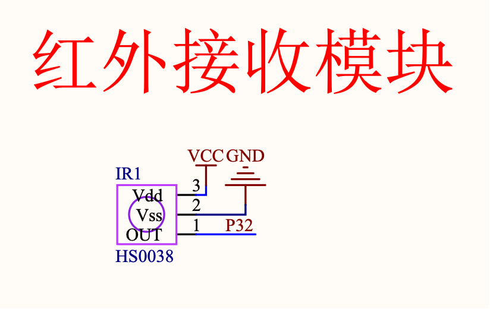

#### 红外遥控

#### 红外线简介

人的眼睛能看到的可见光按波长从长到短排列， 依次为红、 橙、 黄、 绿、 青、 蓝、 紫。 其中红光的波长范围为 0.62～0.76μm；
紫光的波长范围为 0.38～0.46 μm。比紫光波长还短的光叫紫外线，比红光波长还长的光叫红外线。红外线遥控就是利用波长为 0.76～1.5μm 
之间的近红外线来传送控制信号的。

#### 红外遥控原理

红外遥控是一种无线、非接触控制技术，具有抗干扰能力强，信息传输可靠，功耗低，成本低，易实现等显著优点，被诸多电子设备特别是家用电器广泛采用，
并越来越多的应用到计算机系统中。

由于红外线遥控不具有像无线电遥控那样穿过障碍物去控制被控对象的能力，所以，在设计红外线遥控器时，不必要像无线电遥控器那样，每套(发射器和接收器)
要有不同的遥控频率或编码(否则， 就会隔墙控制或干扰邻居的家用电器)，所以同类产品的红外线遥控器，可以有相同的遥控频率或编码，而不会出现遥控信号“串门”的情况。
这对于大批量生产以及在家用电器上普及红外线遥控提供了极大的方便。 由于红外线为不可见光， 因此对环境影响很小，再由红外光波动波长远小于无线电波的波长，
所以红外线遥控不会影响其他家用电器，也不会影响临近的无线电设备。

红外遥控通信系统一般由红外发射装置和红外接收设备两大部分组成。

视频介绍：

https://www.bilibili.com/video/BV1AM411t7Nc/?spm_id_from=333.337.search-card.all.click&vd_source=b8ed8b20bb8136e36167e41851432be8

1. 红外遥控发射红外线信号，红外线接收到红外线信号导通，单片机引脚被拉低到低电平。
2. 控制红外线发射脉冲信号，进行编码，用于更复杂的数据传输(否则只能区分按下或没有按下)。

#### 原理图

红外线接收器，信号引脚接单片机 P3^2 引脚



#### 实验代码

```clike
#include "reg52.h"

#define SMG_A_DP_PORT    P0    // 数码管段码口定义

typedef unsigned int u16;	//对系统默认数据类型进行重定义
typedef unsigned char u8;
typedef unsigned long u32;

// 数码管位选信号控制脚定义
sbit LSA = P2^2;
sbit LSB = P2^3;
sbit LSC = P2^4;

// 红外接收管脚定义
sbit IRED = P3^2;

u8 gired_data[4];  // 存储4个字节接收码（地址码+地址反码+控制码+控制反码）

/**
 * @brief 延时约10us
 * @param ten_us 延时的10us倍数
 */
void delay_10us(u16 ten_us)
{
    while(ten_us--);    
}

/**
 * @brief 红外接收初始化函数
 */
void ired_init(void)
{
    IT0 = 1;    // 下降沿触发
    EX0 = 1;    // 打开中断0允许
    EA = 1;     // 打开总中断
    IRED = 1;   // 初始化端口
}

/**
 * @brief 外部中断0服务函数 - 红外解码
 */
void ired() interrupt 0
{
    u8  ired_high_time = 0;
    u16 time_cnt = 0;
    u8  i = 0, j = 0;

    if(IRED == 0)
    {
        // 等待引导信号9ms低电平结束，若超过10ms强制退出
        time_cnt = 1000;
        while((!IRED) && (time_cnt))
        {
            delay_10us(1);  // 延时约10us
            time_cnt--;
            if(time_cnt == 0)
                return;        
        }
        
        // 引导信号9ms低电平已过，进入4.5ms高电平
        if(IRED)
        {
            // 等待引导信号4.5ms高电平结束，若超过5ms强制退出
            time_cnt = 500;
            while(IRED && time_cnt)
            {
                delay_10us(1);
                time_cnt--;
                if(time_cnt == 0)
                    return;    
            }
            
            // 循环4次，读取4个字节数据
            for(i = 0; i < 4; i++)
            {
                // 循环8次读取每位数据即一个字节
                for(j = 0; j < 8; j++)
                {
                    // 等待数据1或0前面的0.56ms结束，若超过6ms强制退出
                    time_cnt = 600;
                    while((IRED == 0) && time_cnt)
                    {
                        delay_10us(1);
                        time_cnt--;
                        if(time_cnt == 0)
                            return;    
                    }
                    
                    // 等待数据1或0后面的高电平结束，若超过2ms强制退出
                    time_cnt = 20;
                    while(IRED)
                    {
                        delay_10us(10);  // 约0.1ms
                        ired_high_time++;
                        if(ired_high_time > 20)
                            return;    
                    }
                    
                    // 先读取的为低位，然后是高位
                    gired_data[i] >>= 1;
                    // 如果高电平时间大于0.8ms，数据则为1，否则为0
                    if(ired_high_time >= 8)
                        gired_data[i] |= 0x80;
                        
                    ired_high_time = 0;  // 重新清零，等待下一次计算时间
                }
            }
        }
        
        // 校验控制码与反码，错误则返回
        if(gired_data[2] != ~gired_data[3])
        {
            for(i = 0; i < 4; i++)
                gired_data[i] = 0;
            return;    
        }
    }        
}

// 共阴极数码管显示0~F的段码数据
u8 gsmg_code[17] = {
    0x3f, 0x06, 0x5b, 0x4f, 0x66, 0x6d, 0x7d, 0x07,
    0x7f, 0x6f, 0x77, 0x7c, 0x39, 0x5e, 0x79, 0x71
};

/**
 * @brief 数码管显示函数
 * @param dat 要显示的数据数组
 * @param pos 开始显示的位置
 */
void smg_display(u8 dat[], u8 pos)
{
    u8 i = 0;
    u8 pos_temp = pos - 1;

    for(i = pos_temp; i < 8; i++)
    {
        // 位选控制
        switch(i)
        {
            case 0: LSC=1; LSB=1; LSA=1; break;
            case 1: LSC=1; LSB=1; LSA=0; break;
            case 2: LSC=1; LSB=0; LSA=1; break;
            case 3: LSC=1; LSB=0; LSA=0; break;
            case 4: LSC=0; LSB=1; LSA=1; break;
            case 5: LSC=0; LSB=1; LSA=0; break;
            case 6: LSC=0; LSB=0; LSA=1; break;
            case 7: LSC=0; LSB=0; LSA=0; break;
        }
        
        SMG_A_DP_PORT = dat[i - pos_temp];  // 传送段选数据
        delay_10us(100);                    // 延时一段时间，等待显示稳定
        SMG_A_DP_PORT = 0x00;               // 消隐
    }
}

/**
 * @brief 主函数
 */
void main()
{    
    u8 ired_buf[3];

    ired_init();  // 红外初始化

    while(1)
    {                
        // 将控制码高4位转换为数码管段码
        ired_buf[0] = gsmg_code[gired_data[2] / 16];
        // 将控制码低4位转换为数码管段码
        ired_buf[1] = gsmg_code[gired_data[2] % 16];
        ired_buf[2] = 0X76;  // 显示H的段码
        
        smg_display(ired_buf, 6);    
    }        
}
```
