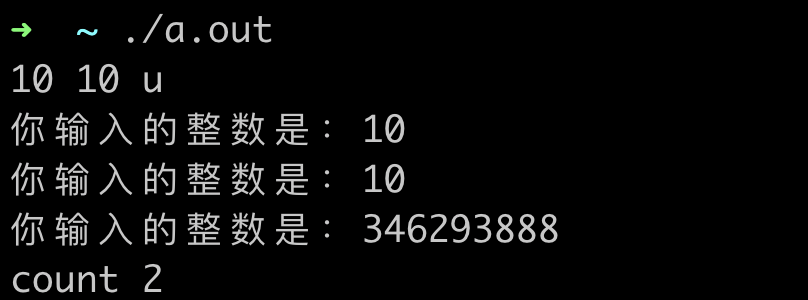
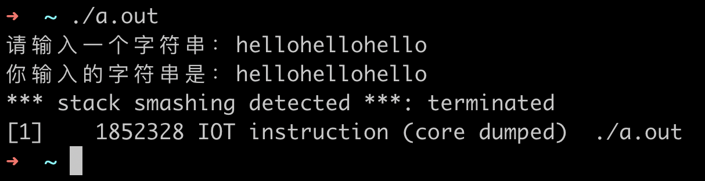
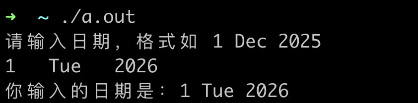

#### 7.4 格式化输入 scanf 函数

scanf 格式化输入函数与 printf 格式化输出函数对应，scanf 函数按照指定的格式，将 **标准输入** 保存到其参数中。

##### 例子 1

下面的例子，在程序运行后，输入一个整数，scanf 会把对应的整数保存到 a 中（回顾一下使用指针修改）。

```clike
#include <stdio.h>

int main()
{
  int a;
  
  printf("请输入一个整数：");
  
  scanf("%d", &a);
  
  printf("你输入的整数是：%d\n", a);
  
  return 0;
}
```

##### 例子 2

scanf 碰到某些输入无法与指定格式匹配时，函数将会结束，并返回匹配中的变量数。

```clike
#include <stdio.h>

int main()
{
  int a;
  int b;
  int c;
  int count;

  count = scanf("%d %d %d\n", &a, &b, &c);

  printf("你输入的整数是：%d\n", a);
  printf("你输入的整数是：%d\n", b);
  printf("你输入的整数是：%d\n", c);

  printf("count %d\n", count);

  return 0;
}
```

运行上面的程序，输入 `10 10 u` ，其中 u 是一个字符，scanf 函数会返回 2（表示处理了两个变量），并把 10 和 10 保存到 a 和 b 中。

 

##### 例子 3

从标准输入接收字符串，scanf 函数不会检查你接收字符串的数组长度，比如下面代码。

```clike
#include <stdio.h>

int main() 
{
  char str[10];
  
  printf("请输入一个字符串：");
  
  scanf("%s", str);
  
  printf("你输入的字符串是：%s\n", str);
  
  return 0;
}
```

运行时候，输入长度大于 10 的字符串，会导致报错，因为长度超出了 str 数组。

 

为了处理上面的长度超出问题，也可以这样处理

```clike
#include <stdio.h>

int main()
{
  char str[10];

  printf("请输入一个字符串：");

  // 指定最大长度
  scanf("%10s", str);

  printf("你输入的字符串是：%s\n", str);

  return 0;
}
```

##### 例子 4

接收多个不同类型数据。

```clike
#include <stdio.h>

int main() 
{
  int year;
  char month[10];
  int day;
  
  printf("请输入日期，格式如 1 Dec 2025\n");
  
  scanf("%d %s %d", &day, month, &year);
  
  printf("你输入的日期是：%d %s %d\n", day, month, year);
  
  return 0;
}
```

运行程序，并按照下图输入，会看到打印的结果。

 

这里需要说明的是：

* 输入数据之间的多个空格，会被忽略，请看上图示例。
* scanf 接收的所有参数，都是指针，因为要直接把值写入到对应的变量。

##### 其他说明

根据经验 scanf 函数在日常开发中，不常用，我们有个大致的了解即可，需要用到时再详细了解。


#### 7.5 文件访问


