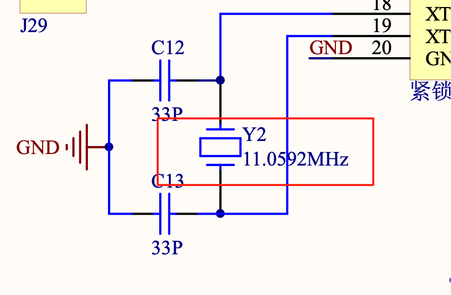

### 定时器

前面学习了使用单片机的外部中断，这一节我们来学习定时器中断。我们将要利用定时器 0 ，实现间隔 1 秒的 LED 闪烁功能。

#### 背景知识

为了使用定时器，我们需要先理解单片机的几个知识点。

1. 振荡周期: 为单片机提供定时信号的振荡源的周期（晶振周期或外加振荡周期），下图为开发板中使用的晶振，振荡频率为 11.0592MHZ (11.0592MHz = 11,059,200 Hz = 11,059,200 次/秒)

<div style="width: 500px">
	
</div>

2. 机器周期: 1 个机器周期等于 12 个振荡周期

计算一下，一个振荡周期需要多少时间？ 1 秒 / 11,059,200 次，约等于 0.000 000 09 秒，所以一个机器周期需要的时间为 12 * 0.000 000 09 秒，约为 1us （微秒）。

> 1 秒等于 1000ms（毫秒）等于 1000 * 1000us (微秒)。

定时器工作过程可以简单描述为: 装载着数值的寄存器，在每个 `机器周期` 自动加 1 (每 1us 加 1)，直到寄存器溢出 (超出寄存器能够存放的数值)，触发中断。

其中，装载数值的寄存器为 TH0 和 TL0，两个八位寄存器组成的存放数值的 "容器" ，最大可以存放 0xFFFF 即十进制 65535。

#### 程序说明

从上面的工作过程可以知道，当寄存器溢出的时候 (65535 再加 1 就会溢出)，就会触发中断。所以我们可以设置寄存器初始值为 65536 - 1000，这样每过 1000 个机器周期 (约为 1 毫秒) 就会发生一次中断，发生 1000 次这样的中断，就相当于产生了一个 1s 的事件。

> 65536 - 1000 = 64536 = 0XFC18 (16进制数, 高 8 位放到 TH0，低 8 位放到 TL0)

```clike
#include "reg52.h"

typedef unsigned int u16;
typedef unsigned char u8;

sbit LED1 = P2^0;

// 定时器设置初始化
void time0_init(void)
{
	TMOD |= 0X01; // 选择为定时器0模式，工作方式1
	TH0 = 0XFC;   // 给定时器赋初值，定时1ms
	TL0 = 0X18;	
	ET0 = 1;      // 打开定时器 0 中断允许
	EA = 1;       // 打开总中断
	TR0 = 1;      // 打开定时器		
}

void main()
{	
	time0_init(); // 定时器0中断配置

	while (1)
	{			
							
	}		
}

// 定时器0中断函数
void time0() interrupt 1 
{
	static u16 i;  // 定义静态变量i
	TH0 = 0XFC;    // 发生中断后，重新给寄存器赋值，让它在 1000 个机器周期后又重新触发中断
	TL0 = 0X18;
	i++;
	if (i == 1000) // 累计发生 1000 次中断，相当于过去了 1 秒
	{
		i = 0;
		LED1 = !LED1;	
	}						
}
```

### 串口通信

```clike
#include "reg52.h"

typedef unsigned int u16;
typedef unsigned char u8;

void uart_init(u8 baud)
{
	TMOD |= 0X20;  // 设置计数器工作方式2
	SCON = 0X50;   // 设置为工作方式1
	PCON = 0X80;   // 波特率加倍
	TH1 = baud;    // 计数器初始值设置
	TL1 = baud;
	ES = 1;        // 打开接收中断
	EA = 1;        // 打开总中断
	TR1 = 1;       // 打开计数器		
}

void main()
{	
	uart_init(0XFA); // 波特率为9600

	while (1)
	{			
							
	}		
}

// 串口通信中断函数
void uart() interrupt 4
{
	u8 rec_data;

	RI = 0;            // 清除接收中断标志位
	rec_data = SBUF;   // 存储接收到的数据
	SBUF = rec_data;   // 将接收到的数据放入到发送寄存器
	while (!TI);       // 等待发送数据完成
	TI = 0;            // 清除发送完成标志位				
}
```