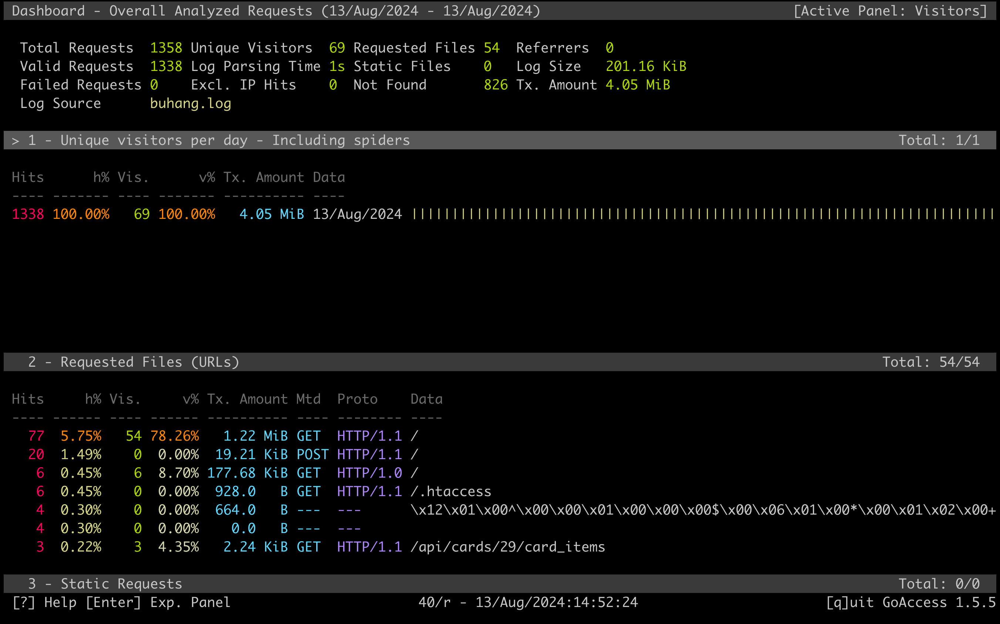
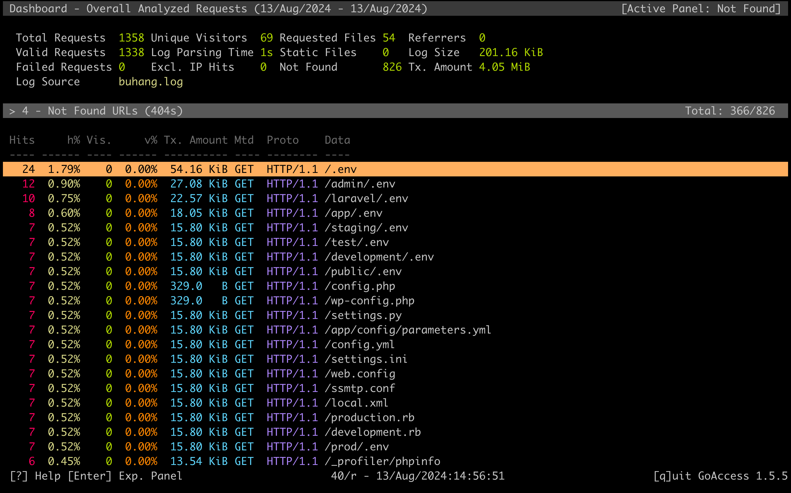
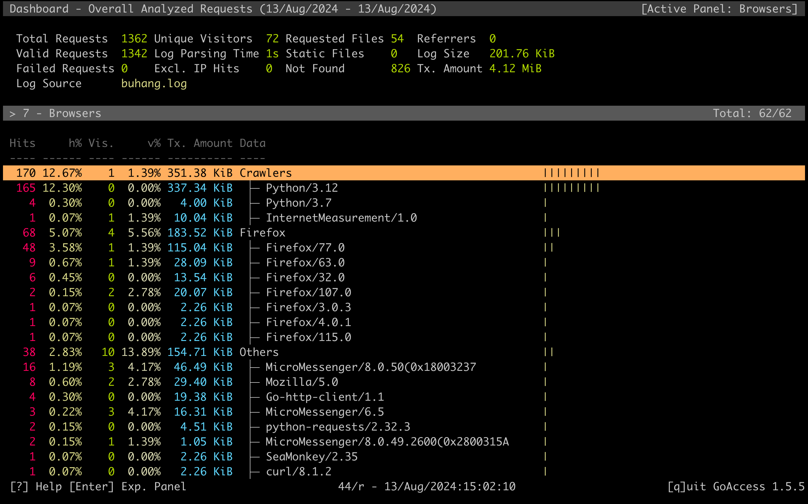
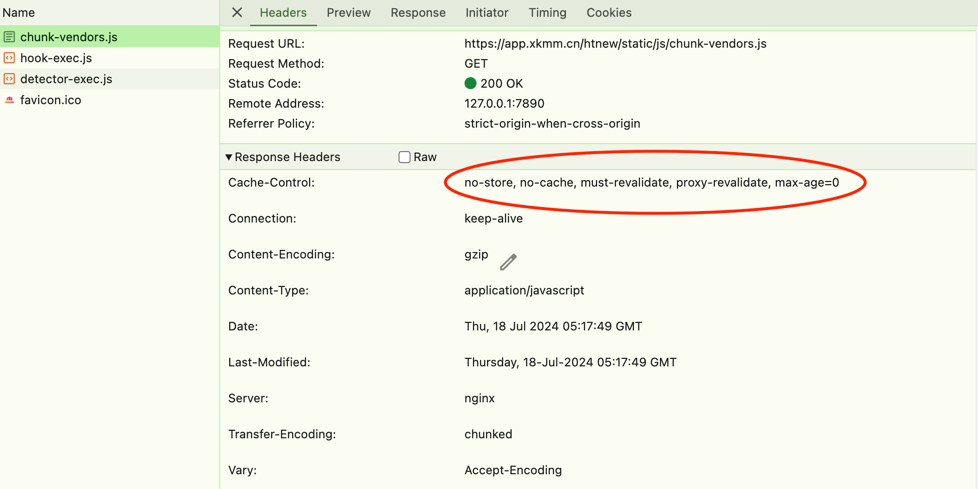
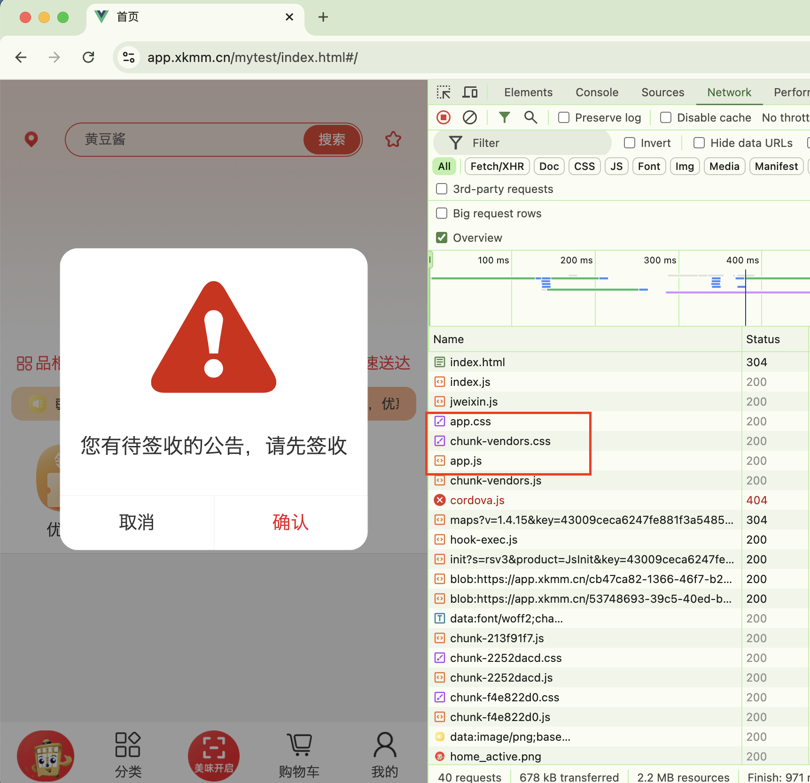
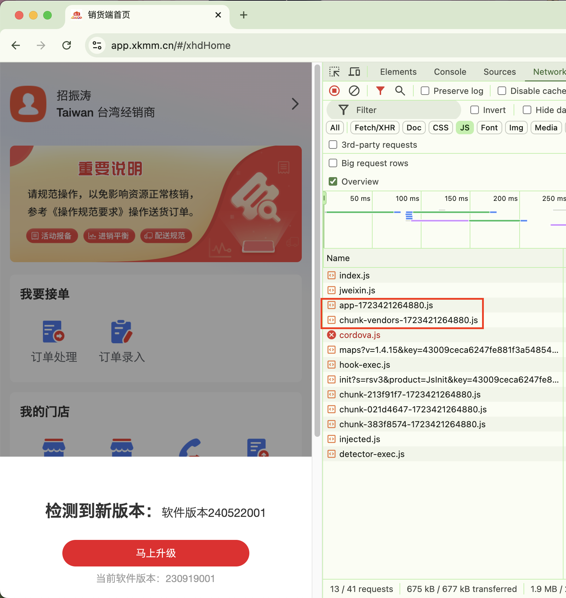

### GoAccess 简介

GoAccess - 可视化 Web 日志分析工具。

GoAccess 是一款开源(MIT许可证)的且具有交互视图界面的实时 Web 日志分析工具，分析结果可以通过你的 Web 浏览器或者 *nix 系统下的终端程序访问。

GoAccess 常见使用场景如下

1. 检查是否有异常流量（异常的 ip 访问数量、扫描不存在的路径、提交可执行脚本、可疑的 User-Agent 和 OS）
2. 检查应用流量是否合理（接口访问次数是否正常）
3. 简单的独立访问用户统计

### GoAccess 的使用

如果你的 Nginx 日志按默认格式输出，那么不需要任何配置，直接运行下面命令就可以进行日志分析。如果分析的日志为实时日志，则会把分析结果刷新到终端中。

```shell
$ goaccess your_access.log
```

分析结果



恶意流量



非法 User-Agent



### GoAccess In Action

下面以小康的一次流量优化为例，说明一下如何借助 GoAccess 找到系统中可优化的地方。

以下为小康服务器 2024-06-18 的访问记录分析结果，分析结果输出到 html 文件中。

<iframe src="../files/all.html" height="800px"></iframe>

#### 统计结果分析

根据上面的分析结果可以看到，静态资源传输流量为 125.57 GiB，占总流量约 67% 。通过对静态资源传输数据量大小进行排序，可以看到 /htnew/static/js/chunk-vendors.js 文件消耗流量最高，单个文件消耗流量 5.03 GiB。

接下来，根据上面的文件路径重新到 Nginx 日志过滤一下，可以确定其完整的访问路径。得到完整的访问路径后在浏览器中访问，可以看到 http 响应头中出现的缓存控制字段如下图所示。



由于该字段的出现，导致用户每次访问小康相关的前端页面时，都需要完整加载所有的前端资源 ( js、css、image )，无法利用客户端本身的缓存，造成用户端流量的浪费，同时也增加了服务器的带宽压力。

#### 单页应用的访问

<div style="text-align: center">
    
</div>

通常情况下，当浏览器访问一个网站时，会缓存以下类型的资源以加快后续访问的速度并减少网络流量：

1. HTML 页面，主页面内容，即页面的 HTML 文件，可能会被缓存
2. CSS 文件
3. JavaScript 文件
4. 图像文件，图片资源（如 .jpg, .png, .gif, .svg 等）会被缓存，尤其是网站中的 logo、背景图等不常变化的图片。


<div style="text-align: center">
    
</div>

发布新版本，

<div style="text-align: center">
    
</div>

#### 问题原因和优化方案

经检查，上面提到的缓存控制字段是人为加入到 Nginx 配置中的，目的是为了每次有版本更新时，可以及时让用户访问到，避免用户因访问到浏览器缓存导致出现问题(白屏、错误等)。

检查前端加载情况，可以看到前端的静态资源中有固定名字的文件(红框以外的文件不确定名字是否固定)，这种文件就是 Nginx 配置中加入强制刷新的元凶。



优化方案，每次打包时，给静态资源文件增加一个变数。

因为静态资源文件都是由 index.html 直接或间接引用，所以只要用户加载到新版本的 index.html 时，会加载不同路径的 js、css 文件，不会受浏览器缓存影响。



优化后，可以正常利用用户浏览器中的缓存，降低服务器带宽压。
