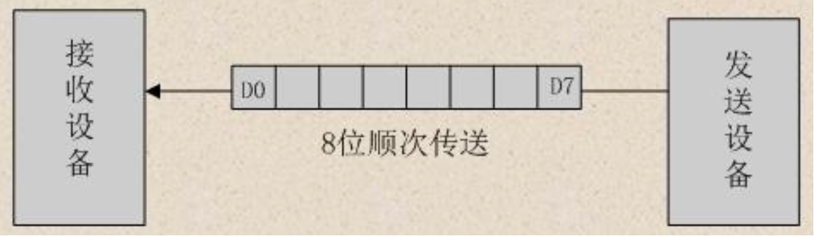
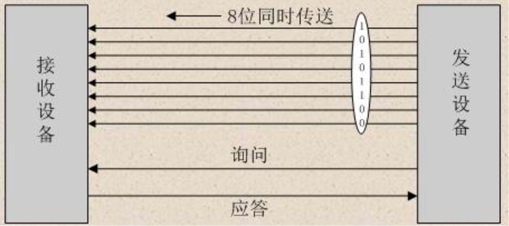
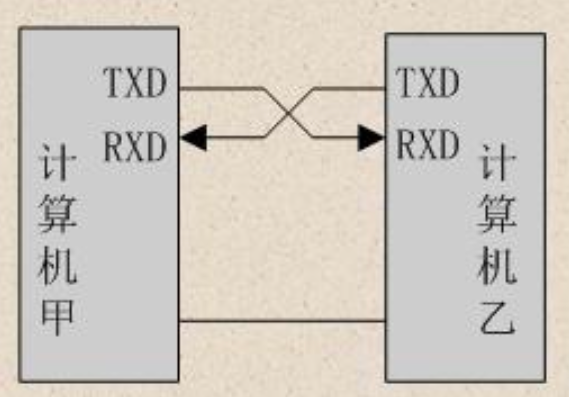
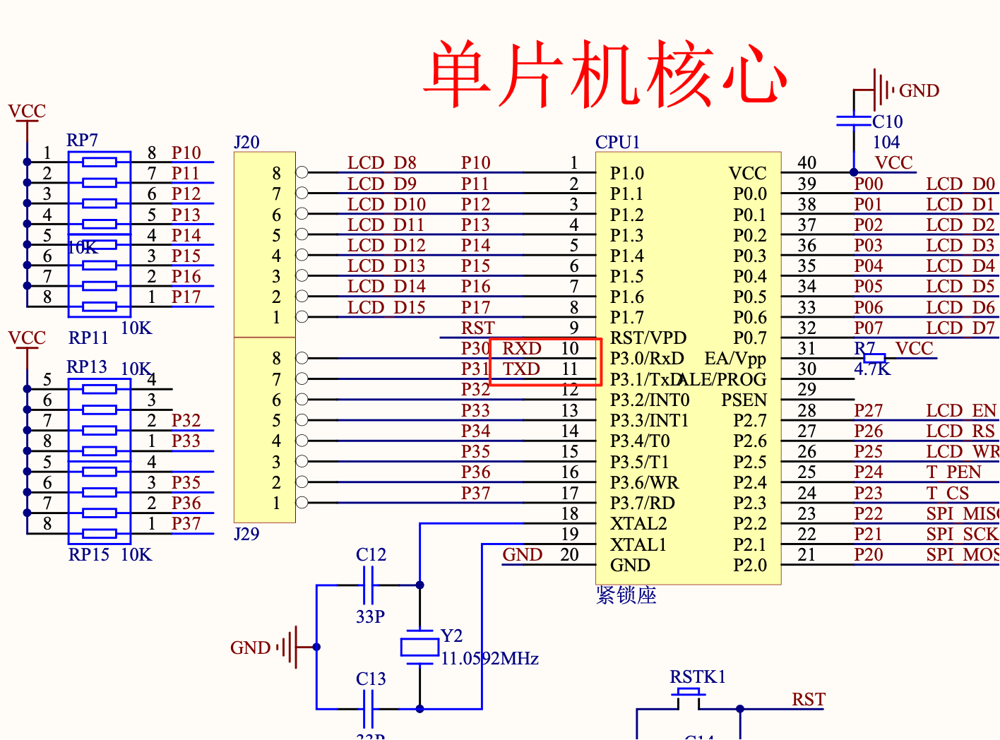
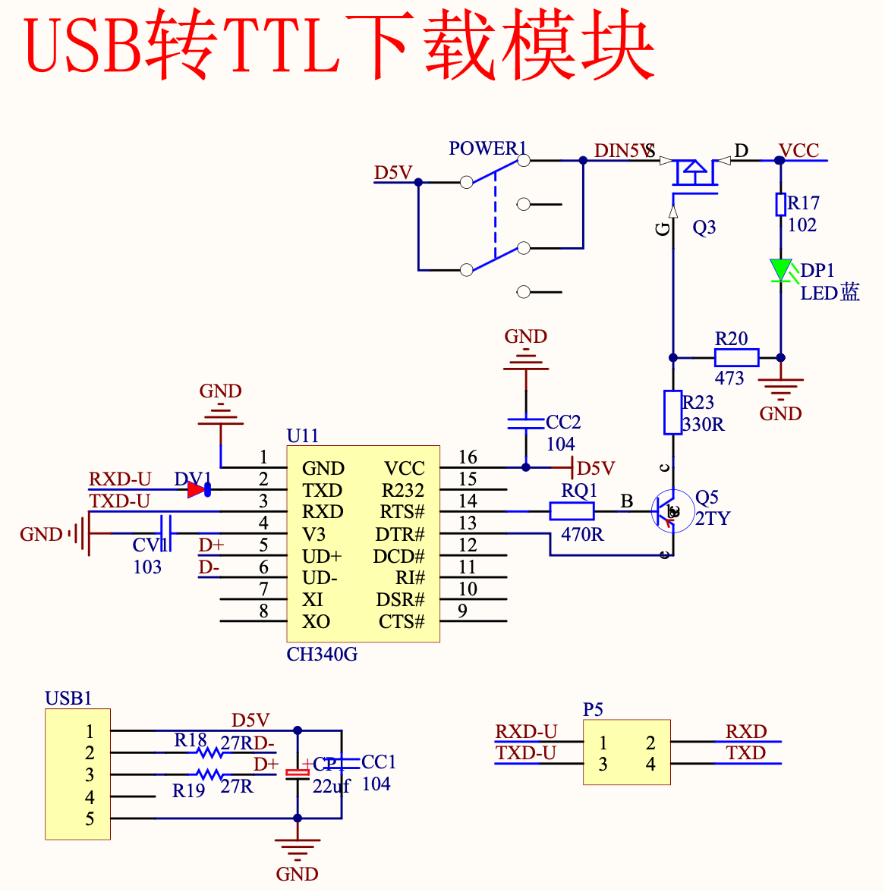

### 串口通信

#### 通信基本概念

##### 串行通信

串行通信是指使用一条数据线，将数据一位一位地依次传输，每一位数据占据一个固定的时间长度。 其只需要少数几条线就可以在系统间交换信息， 
特别适用于计算机与计算机、计算机与外设之间的远距离通信。



串行通信的特点：传输线少，长距离传送时成本低，且可以利用电话网等现成的设备，但数据的传送控制比并行通信复杂。

##### 并行通信

并行通信通常是将数据字节的各位用多条数据线同时进行传送，通常是 8 位、16 位、32 位等数据一起传输。如下图所示：



并行通信的特点：控制简单、传输速度快；由于传输线较多，长距离传送时成本高且接收方的各位同时接收存在困难，抗干扰能力差。

##### 通信速率

通信速率，指的就是每秒能够传输的 "位" 的个数 (bit 中文比特)，单位是 `位 / 秒 (英文简称 bps， bits per second)` 也被称作 `比特率`。

比如，如果每秒能够传输 240 位数据，就是 240 bps。

后面提到的 `波特率`，暂时可以认为与 `比特率` 一样。

#### 开发板中的串口

最简单的串口通信电路图如下。只需要将自己的发送端 `TXD` 对接对方的接收端 `RXD`，将自己的接收端 `RXD` 对接对方的发送端 `TXD` 即可（还有接公共地线）。



单片机的 `TXD` 和 `RXD` 在原理图中的红框位置。



单片机与电脑通信时，使用了 USB 转串口模块，暂时只需要知道单片机的数据是从 `TXD` 发送出去，`RXD` 接收过来就可以。



```clike
#include "reg52.h"

typedef unsigned int u16;
typedef unsigned char u8;

void uart_init(u8 baud)
{
	TMOD |= 0X20;  // 设置计数器工作方式2
	SCON = 0X50;   // 设置为工作方式1
	PCON = 0X80;   // 波特率加倍
	TH1 = baud;    // 计数器初始值设置
	TL1 = baud;
	ES = 1;        // 打开接收中断
	EA = 1;        // 打开总中断
	TR1 = 1;       // 打开计数器		
}

void main()
{	
	uart_init(0XFA); // 波特率为9600

	while (1)
	{			
							
	}		
}

// 串口通信中断函数
void uart() interrupt 4
{
	u8 rec_data;

	RI = 0;            // 清除接收中断标志位
	rec_data = SBUF;   // 存储接收到的数据
	SBUF = rec_data;   // 将接收到的数据放入到发送寄存器
	while (!TI);       // 等待发送数据完成
	TI = 0;            // 清除发送完成标志位				
}
```